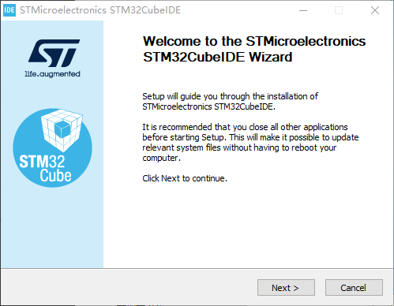
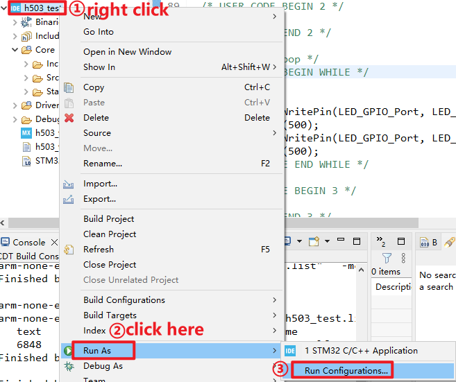

32-bit microcontrollers are gaining popularity due to their more powerful and affordable features compared to 8-bit and 16-bit microcontrollers. ALIENTEK team offers a M48Z-M33 Mini Board, and the accompanying STM32CubeIDE provides many examples. The following gives you an overview of the steps to use STM32CubeIDE.<a name="catalogue"></a>

## 1 Introduction

STM32CubeIDE is a free software development tool provided by ST and a member of the STM32Cube ecosystem. It is based on the Eclipse®/CDT framework, GCC compilation toolchain and GDB debugging tool, and supports the addition of third-party function plug-ins. At the same time, STM32CubeIDE integrates the STM32 configuration and project creation functions of STM32CubeMX, providing an all-in-one tool experience and greatly saving installation and development time. Users only need STM32CubeIDE, which can complete all the work from chip selection, project configuration, code generation, to code writing, compiling, debugging and burning. It is the embedded development tool of STM32.


## 2 Installing 
### 2.1 Installing a Java environment

JAVA environment is required before installing STM32CubeIDE, so JAVA8 needs to be installed first. For Java runtime environment, you can go to the Java official website **www.java.com** to download the latest Java software, here you need to pay attention to the STM32CubeIDE Java runtime environment version must be V1.7 or above, if your computer installed V1.7 or below version, Please delete and reinstall the latest version.

### 2.2 Installing STM32CubeIDE

First of all, we will go to the official website of ST to download STM32CubeIDE(at the time of this writing, I am using STM32CubeIDE v1.14.1). Please note that you need to register an account on the ST website for free.


As you can see from the above figure, STM32CubeIDE can support multiple operating system platforms, including Windows, Linux, and MacOS. However, it is important to note that the software only supports the 64-bit version of the operating system. According to your own computer system to download the corresponding version of STM32CubeIDE.Then follow the installation process, accepting all the defaults.




#### 2.2.1 CH340 USB virtual serial port driver installation

Install CH340 USB virtual serial port driver, so that we can use the computer to communicate through USB and STM32 serial port. The USB virtual serial port chip used by the Mini Board is CH340C, and its driver has been put in the data package, you can go to: **4_tools->CH340_Drivers.zip** to find. Double click **CH341SER.EXE** to install, after installation, as shown in Figure.


After the driver is installed successfully, the USB interface of the Mini Board is connected to the computer through USB, and the computer will automatically install the driver. After installation, you can find the USB serial port in the Device manager of the computer (if not, restart the computer), as shown in the picture.


After installing the CH340 USB virtual serial port, we can use the serial debugging assistant, such as XCOM, and our Mini Board to communicate through the serial port, which we will introduce to you in the subsequent content. At this point, the development environment of STM32 is set up.

## 3 Using STM32CubeIDE 
### 3.1 Create a new project

Start STM32CubeIDE, and you will be presented with a window asking you to choose your workspace.The workspace here is simply the directory where you keep all your project files on your computer. Here is my save path and then click Launch.


After that, We click **File->New->STM32 Project** in the menu bar in the upper left corner, as shown in the following figure:


In the following figure, we enter the STM32CubeMX plugin interface:


First select the model of the chip, here we use **STM32H503CBT6**, and then click the chip in ②, click Next to enter the next step. Next up is naming the project:


Once the project is named, the other options will be available by default. Click **Next** to continue setting the firmware package version of the project.


Here you can choose your version of the firmware package. We don't need to download it for now, we will explain how to download the firmware package later.
If you haven't downloaded the firmware package, you'll get the following warning:


### 3.2 Get the STM32Cube firmware package

The above prompts that you have not downloaded the firmware package of STM32H5. We will click OK and then explain how to download it.
Click **Help->Manage Embedded Software Packages** in the upper menu bar, as shown below


We find the STM32H5 series in the pop-up window, there are two ways to choose from, the first is if you have downloaded the firmware package before, you can directly add it from the local. The second way is that we can download it directly on the Internet.


Here we are on the second kind of method, enter the ST's official website ``https://www.st.com/content/st_com/en.html``, to search in the search box input STM32CubeH5.


Once you find this page, select a version to download.


When we complete the download, we return to the interface of STM32CubeIDE, find the firmware package we just downloaded and add it. Here, we can add it in the format of compressed package, as shown below:


Here I downloaded the version of V1.1.0, after the completion of the addition, the front of the small box will show that the bean paste green color has been added successfully.


### 3.3 Configuring the project

We continue to go back to the CubeMX configuration interface, we first configure the RCC clock source, here we set the high and low speed clock source are generated by the external crystal, as shown below.


We also need to configure the GPIO mode, etc., as shown in the following figure:


According to the schematic diagram of the Mini board, we know that the led used on the board have been connected to the Mini Board, and no additional operations are needed, as shown below:


The positive terminal of the LED is connected to the positive terminal of the power supply through a current limiting resistor, while the negative terminal is connected to the PA8 pin of the MCU. Therefore, as long as the PA8 pin output low level is controlled, the LED can be lit. For further configuration, click **System Core->GPIO**, select the pin we want to set, and follow the following figure for further configuration:


The last thing to do is to configure the clock tree, which is very convenient because it provides a very intuitive graphical representation. Since the external high-speed crystal oscillator on the STM32H503 is 8M, and the official recommended main frequency clock is 250MHz, the specific Settings are shown in the following figure.


After the clock tree is set up, the project configuration is finally carried out. Select Project Manager->Project, fill in the name of the project, and then below the Minimum Heap Size and Minimum Stack Size is to set the heap and stack size of the project, set according to the picture.


Then select the Code Generator option in the left selection bar and check it as shown below:


Once that's done, we press this button in the menu bar to generate the initialization code.


The structure of the generated code is shown in the figure below. The structure of the experimental routines provided in our resource package is different from the one shown below, because we have made some optimizations to the structure of the routine files to reduce the file size.


In the file viewer on the left side, click on **Src->main.c** to open main code of our project.You will see a number of automatically generated functions calls that assist in setting up our system clocks and peripherals. You only need to worry about the parts between the /* USER CODE */ guards.

```c
int main(void)
{
  /* USER CODE BEGIN 1 */

  /* USER CODE END 1 */

  /* MCU Configuration--------------------------------------------------------*/

  /* Reset of all peripherals, Initializes the Flash interface and the Systick. */
  HAL_Init();

  /* USER CODE BEGIN Init */

  /* USER CODE END Init */

  /* Configure the system clock */
  SystemClock_Config();

  /* USER CODE BEGIN SysInit */

  /* USER CODE END SysInit */

  /* Initialize all configured peripherals */
  MX_GPIO_Init();
  /* USER CODE BEGIN 2 */

  /* USER CODE END 2 */

  /* Infinite loop */
  /* USER CODE BEGIN WHILE */
  while (1)
  {
    HAL_GPIO_WritePin(LED_GPIO_Port, LED_Pin, GPIO_PIN_RESET);  /* turn on LED */
    HAL_Delay(500);
    HAL_GPIO_WritePin(LED_GPIO_Port, LED_Pin, GPIO_PIN_SET);    /* turn off LED */
    HAL_Delay(500);
    /* USER CODE END WHILE */

    /* USER CODE BEGIN 3 */
  }
  /* USER CODE END 3 */
}
```

### 3.4 Compiling

So far, we have finished writing the software. Then you can click the small hammer compiler in the toolbar. The compilation process will be output in the Consle window below, as shown in the following figure:


To sum up, compile 0 error, 0 warning, means that the program syntax is fine. We'll start downloading and debugging the program to verify that it works.

### 3.5 Running


The normal situation is: after the Mini Board is powered on, the power indicator (blue light) is normally on, and the DAP simulator light is blue. If the DAP simulator light is always red or not on, it means that the simulator is not connected properly. Please check whether the USB cable has been connected, and you can plug and replace the USB cable.

We proceed to the project download configuration screen as follows:



After entering the project download configuration screen, select the compiled file you want to use, as follows:


Go to the debugger configuration screen and do the following:


After the configuration is complete, you can see the newly generated.cfg debugger configuration file on the left side of the STM32CubeIDE interface.


We can find it in our IDE project directory and save it as dap.cfg. We need to make some changes to the dap.cfg file, as shown below (note that the red box is where the changes are) :


Just make two changes as shown above. Then go to the download and configuration interface of the project, add the modified file in here, save it in the h503_test folder, and the whole setup work is finished, as shown below:


Again, we go to the debugger configuration screen, where the Settings look like the following:


Let's go back to the main CubeIDE screen and just click **Run** on the download program. Note that when the download is successful, the program can not run directly, you need to press the reset button of the Mini board to work normally.


### 3.6 Debugging

We go to the engineering interface, click **Run->Debug Configurations->Ddebug** to debug or you can directly click the crawler in the menu bar to enter the simulation debugging interface, and the following prompt will appear whether to Switch to the debug perspective, which is the debugging interface, click Switch to switch. Check the Remember my decision box on the left, and this prompt will not pop up again.


[back to title](#catalogue)
