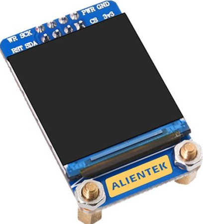

## 1 Repository overview

This repository is structured as follows:

+ A [1_docs](./1_docs) folder, containing related documentation, includes schematic diagrams, data sheets, pictures of each example configuration, pin elicitation diagrams, and pin assignment tables.
+ A [2_tools](./2_tools) folder, containing Development tools. Such as Flash download software, USB virtual serial port driver, and serial port terminal, etc
+ An [example](./examples) folder, containing examples of different peripherals.
+ A [libraries](./libraries) folder, containing HAL library for STM32H5.

## 2 Board Resources

Here aims to introduce the **hardware and software resources** of the M48Z-M33 Mini Board, including the introduction of chip resources, the introduction of experimental platform hardware resources, and the supporting resource use guide. By studying this manual, the reader will have a comprehensive understanding of the resources of the Mini Board, which will be very helpful for subsequent program design.

It is intended to provide readers with a comprehensive introduction to the M48Z-M33 Mini Board resources. It is highly recommended that you read this manual before learning the examples!

### 2.1 Hardware Description

M48Z-M33 Mini Board selects **STM32H503CBT6** as MCU, the chip integrates FPU instructions, It has 32KB SRAM, 128KB FLASH, 6 16-bit timers, 1 GPDMA controller (total 8 channels), 3 SPI, 3 full-duplex I2S, 3 U(S)ART, 1 FDCAN, 1 12-bit ADC, 1 RTC (with calendar function) and 37 general IO ports.

+ **USB interface**: this interface can not only be used as a USB slave communication interface, but also has a power supply function, which can supply power for the Mini Board. USB_Slave can be used to connect the computer to realize the USB virtual serial port experiment.
+ **SWD debug port**: used for simulation debugging, downloading code, etc.;
+ **Reset button**: used to reset the Mini Board.

### 2.2 Software Resources

There are up to **35** examples provided. Before learning each example, carefully read the **README.md**, which includes a brief introduction to the example function, hardware hookup, STM32CubeIDE configuration instructions, and running phenomena. Here are all the examples.

| Num                  | Example Name                      | Num  | Example Name                                  |
| -------------------- | --------------------------------- | ---- | ---------------------- |
| 00                   | h503_test                         | 12   | 12_RTC                                           |
| 01                   | 01_LED                            | 13_1 | 13_1_LowPower_PVD                                |
| 02                   | 02_KEY                            | 13_2 | 13_2_LowPower_Sleep                              |
| 03                   | 03_EXTI                           | 13_3 | 13_3_LowPower_Stop                               |
| 04                   | 04_UART                           | 13_4 | 13_4_LowPower_Standby                            |
| 05                   | 05_IWDG                           | 14   | 14_DMA                                           |
| 06                   | 06_WWDG                           | 15_1 | 15_1_ADC_Single_Channel                          |
| 07                   | 07_BTIM                           | 15_2 | 15_2_ADC_DMA_Single_Channel                      |
| 08_1                 | 08_1_GTIM_Interrupt               | 15_3 | 15_3_ADC_DMA_Multi_Channel                       |
| 08_2                 | 08_2_GTIM_PWM                     | 16   | 16_ADC_Temperature                               |
| 08_3                 | 08_3_GTIM_Capture                 | 17_1 | 17_1_DAC_Output                                  |
| 08_4                 | 08_4_GTIM_Count                   | 17_2 | 17_2_DAC_Triangular_Wave                         |
| 09_1                 | 09_1_ATIM_NPWM                    | 17_3 | 17_3_DAC_Sine_Wave                               |
| 09_2                 | 09_2_ATIM_Compare                 | 18   | 18_FLASH_EEPROM                                  |
| 09_3                 | 09_3_ATIM_CPLM_PWM                | 19   | 19_RNG                                           |
| 09_4                 | 09_4_ATIM_PWM_IN                  | 20   | 20_MALLOC                                        |
| 10                   | 10_TFTLCD_MCU                     | 21   | 21_IAP_Bootloader                                |
| 11                   | 11_USMART                         | 22   | 22_USB_VSP                                       |                                 

## 3 How to use STM32CubeIDE
If you have not set up **STM32CubeIDE** or can't use it, you will need to do so following the [steps outlined in this tutorial](./1_docs/STM32CubeIDE_Usage_Guide.md).

## 4 Accessories
When using the MIni Board, you can use the following accessories.
 
| LCD module         | Dap Debugger   | USB to Serial Port module  | Digital Oscilloscope
| ------------------ | ----------------|---------------------------------------|------------------------------------------------ |
|      |         |      |  

