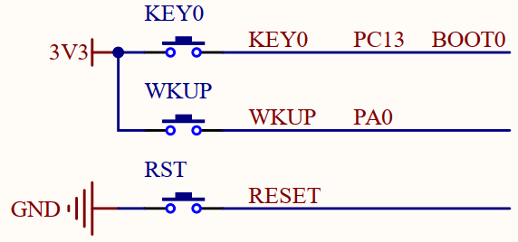
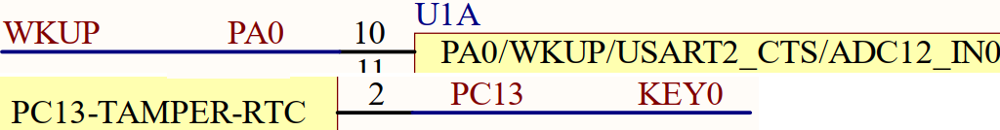
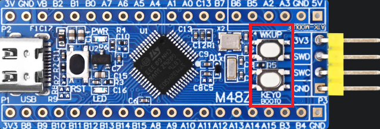
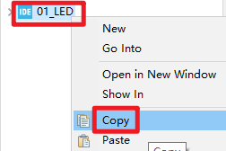
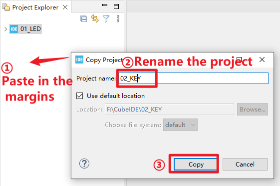
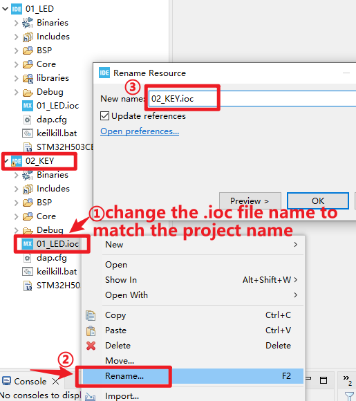
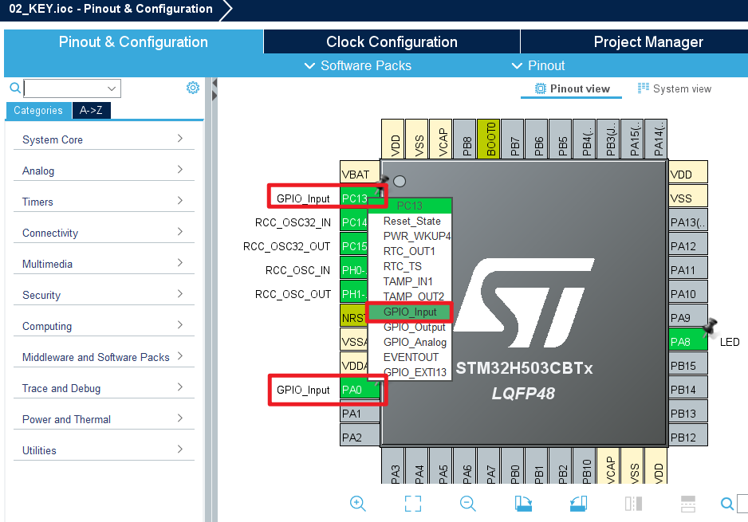
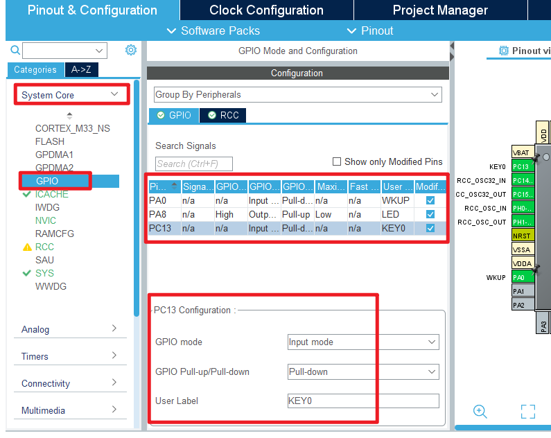
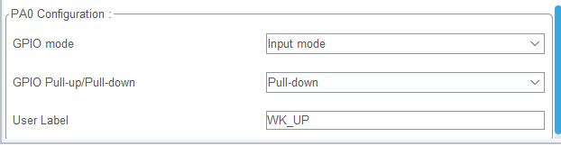

## KEY example<a name="catalogue"></a>

### 1 Brief
The main function of this code is to control the red LED through the on-board keys KEY0 and WKUP.
### 2 Hardware Hookup
The hardware resources used in this experiment are:
+ LED - PA8
+ KEY - WKUP(PA0)
+ KEY - KEY0(PC13) 

The schematic diagram is as follows:





As shown in the figure above, *KEY0* and *WKUP* are respectively connected to *PC13* and *PA0* of the MCU. It should be noted here that WKUP and KEY0 are both "high" active, and there is no external pull-down resistor, so you need to set the pull-down inside the STM32H503 to determine the setting of the idle level state.

The position of KEY in the Mini board is shown in the following figure:



### 3 STM32CubeIDE Configuration

Here we will explain how to configure KEY experiments in the STM32CubeIDE. First of all, we make a copy of the experiment in the previous chapter, as shown in the figure below:



Then click on the blank space on the right, paste the project, and name the project ``02_KEY``, as shown below:



We can see that a new project file will appear on the right, but its.ioc file name is inconsistent with the project file name, so double-clicking the.ioc file cannot be opened normally, we need to rename the **.ioc** file:



In this way, we can get a new project ``02_KEY``, which inherits all the configurations of the previous chapter, on this basis, add functions related to the KEY, so as to avoid repeating the configuration of the LED part and the system clock part, which can greatly improve the efficiency.
Then we double-click **02_key.ioc** to enter the STM32CubeMX tool, and configure PA0 and PC13 at the IO port of the KEY pin to the mode of **GPIO_Input**.



Next, configure the GPIO working mode, and the result of pin configuration is as shown in the figure below:





Click **File > Save**, and you will be asked to generate code.Click **Yes**.

##### code
Then we add the key driver file *key.c/key.h* in the BSP folder. We show the code of key.c here.

###### key.c

```c#
uint8_t key_scan(uint8_t mode)
{
    static uint8_t key_up = 1;                /* Press the button to release the flag */
    uint8_t keyval = 0;

    if (mode == 1)
    {
    	key_up = 1;                           /* support for linking */
    }

    if (key_up && (KEY0 == 1 || WK_UP == 1))  /* The key release flag is 1, and any key is pressed */
    {
    	HAL_Delay(10);                        /* delay 10ms */
        key_up = 0;

        if (KEY0 == 1)
        {
            keyval = KEY0_PRES;
        }

        if (WK_UP == 1)
        {
            keyval = WKUP_PRES;
        }
    }
    else if (KEY0 == 0 && WK_UP == 0)         /* Without any key pressed, the marker key is released */
    {
        key_up = 1;
    }

    return keyval;                            /* return key value */
}
```
The function above realizes the key scan and has the function of eliminating the shake of the key.
##### main.c
Open up main.c, and modify it to look like the following: 
```c#
int main(void)
{
  /* USER CODE BEGIN 1 */
  uint8_t key;
  /* USER CODE END 1 */

  /* MCU Configuration--------------------------------------------------------*/

  /* Reset of all peripherals, Initializes the Flash interface and the Systick. */
  HAL_Init();

  /* USER CODE BEGIN Init */

  /* USER CODE END Init */

  /* Configure the system clock */
  SystemClock_Config();

  /* USER CODE BEGIN SysInit */

  /* USER CODE END SysInit */

  /* Initialize all configured peripherals */
  MX_GPIO_Init();
  MX_ICACHE_Init();
  /* USER CODE BEGIN 2 */

  /* USER CODE END 2 */

  /* Infinite loop */
  /* USER CODE BEGIN WHILE */
  while (1)
  {
    key = key_scan(0);           /* scan key */
    switch (key)
    {
        case KEY0_PRES:          /* KEY0 is pressed */
        {
            LED_TOGGLE();        /* LED state is flipped */
            break;
        }
        case WKUP_PRES:          /* WKUP is pressed */
        {
            LED_TOGGLE();        /* LED state is flipped */
            break;
        }
        default:
        {
            break;
        }
        HAL_Delay(10);           /* delay 10ms */
    }
    /* USER CODE END WHILE */

    /* USER CODE BEGIN 3 */
  }
  /* USER CODE END 3 */
}
```
The above code calls the key scan function every 10 milliseconds to scan the status of the key.

### 4 Running
#### 4.1 Compile & Download
After the compilation is complete, connect the DAP and the Mini Board, and then connect to the computer together to download the code to the Mini Board.
#### 4.2 Phenomenon
Press the reset button to restart the Mini Board, and observe that the LED on the Mini Board is off. At this time, press the WKUP or KEY0 button, you can see the status of the LED flip.

[jump to title](#catalogue)
