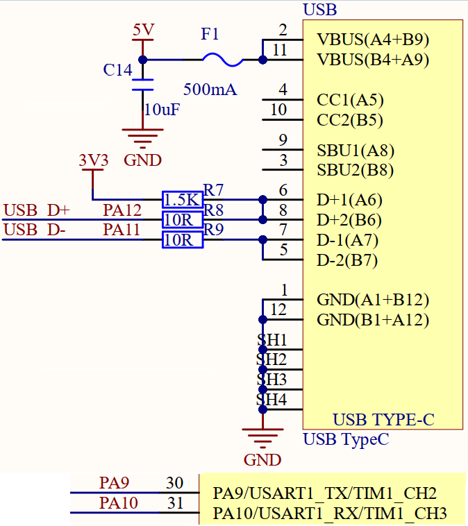
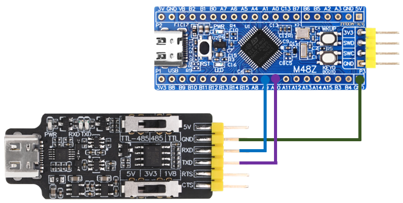
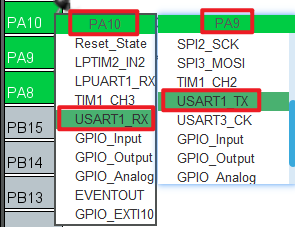
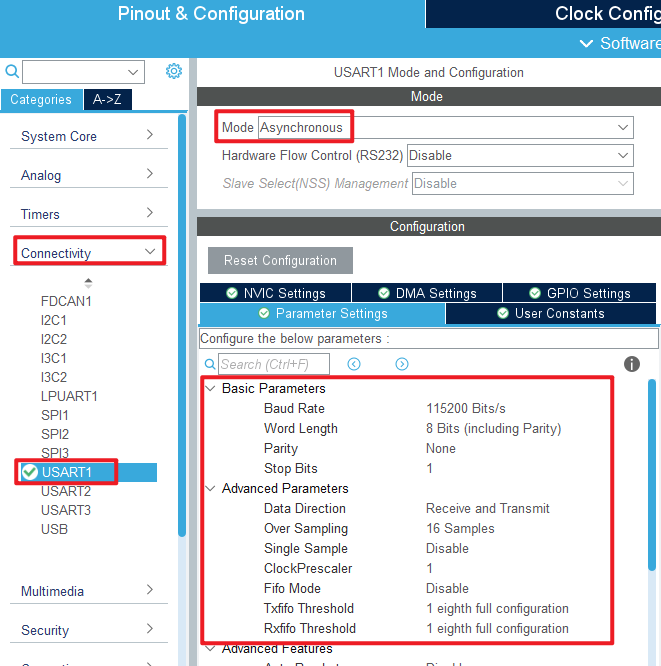
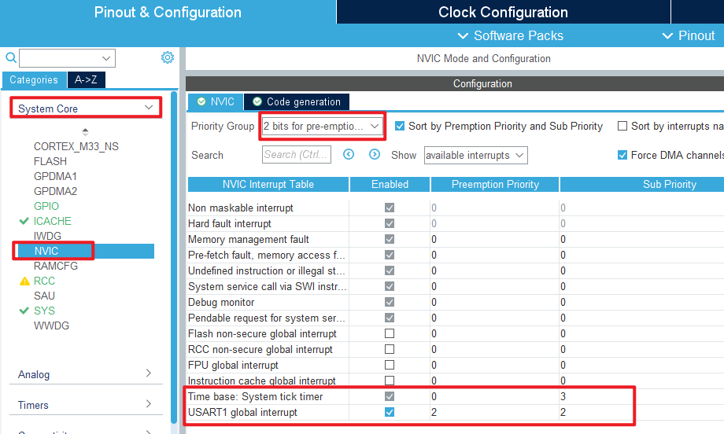
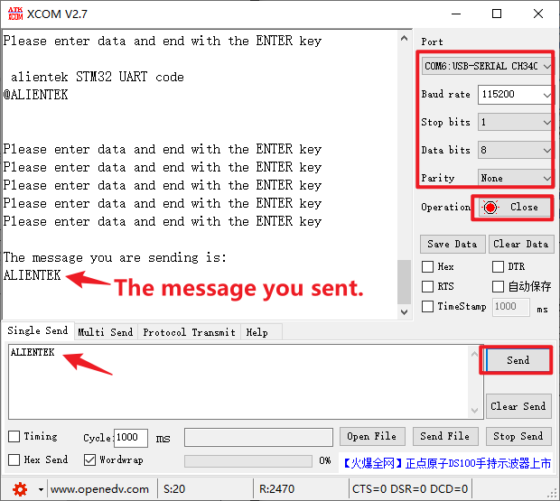

## USART example<a name="brief"></a>

### 1 Brief
The main function of this code is that STM32 talks with the host computer through USART1, and STM32 will return to the host computer after receiving the string sent by the host computer. At regular intervals, the serial port sends a message to the computer.
### 2 Hardware Hookup
The hardware resources used in this experiment are:
+ LED - PA8
+ USART1 - PA9\PA10



USART1 used in this experiment needs to be connected to an ATK-MO340P module, and the connection method is as follows:



Note that pin PA9 and PA10 of the serial port are connected to RXD and TXD of the module, respectively.

### 3 STM32CubeIDE Configuration

Let's copy the project from **02_KEY** and rename both the project and the.ioc file **04_UART**. Next we start the UART configuration by double-clicking the **04_UART.ioc** file.

First, you need to configure the pin of the serial port, as shown in the following figure:



Then configure the specific parameters of the serial port, as shown in the following figure:



In this experiment, serial port will be used to receive interrupts, so NVIC should be configured, as shown in the figure below:



Click **File > Save**, and you will be asked to generate code.Click **Yes**.

##### code
In the initialization code generated in this experiment, we modify the two files usart.c and usart.h. First let's look at the usart.h file:
###### usart.h
```c#
/* USER CODE BEGIN Includes */
#include "stdio.h"	/* Serial port redirection is used in */
/* USER CODE END Includes */

/* USER CODE BEGIN Private defines */
#define USART_REC_LEN        200  /* The maximum number of bytes received is defined as 200 */
#define RXBUFFERSIZE   	      1   /* cache size */

extern uint8_t  g_usart_rx_buf[USART_REC_LEN];  /* Receive buffer, maximum USART_REC_LEN bytes. The last byte is a newline character */
extern uint16_t g_usart_rx_sta;                 /* Receiving status marking */
extern uint8_t g_rx_buffer[RXBUFFERSIZE];       /* The HAL library USART receives buffers */
/* USER CODE END Private defines */
```
We added the header stdio.h for serial port redirection; ``USART_REC_LEN`` represents the maximum number of bytes received, which is defined here as 200 bytes. Later, if you want to send larger packets, you can change this value. Here, do not change too much to avoid wasting too much memory. ``RXBUFFERSIZE`` is the buffer size.

###### usart.c
The following describes the modified usart.c file. In order to make the serial port support printf, the serial port needs to be redirected, and the code is added as follows:
```c#
/* Serial port redirection */
#ifdef __GNUC__
#define PUTCHAR_PROTOTYPE int __io_putchar(int ch)
#else
#define PUTCHAR_PROTOTYPE int fputc(int ch, FILE *f)
#endif

PUTCHAR_PROTOTYPE
{
    HAL_UART_Transmit(&huart1, (uint8_t*)&ch, 1, HAL_MAX_DELAY);
    return ch;
}
```
This experiment is to realize the sending and receiving of serial ports, so the following code should be added to the initialization function ``MX_USART1_UART_Init``.
```c#
  /* USER CODE BEGIN USART1_Init 2 */
  /* This function enables the receive interrupt: flag UART_IT_RXNE and sets
   * the receive buffer and the maximum amount of data the receive buffer can receive */
    HAL_UART_Receive_IT(&huart1, (uint8_t *)g_rx_buffer, RXBUFFERSIZE);
  /* USER CODE END USART1_Init 2 */
```
The function ``HAL_UART_Receive_IT`` is called to enable the receive interrupt and set the cache to be received and the amount of data to be received.
Then we use the following serial port receive completion interrupt function ``HAL_UART_RxCpltCallback`` to process the user's logical code:

```c#
void HAL_UART_RxCpltCallback(UART_HandleTypeDef *huart)
{
    if (huart->Instance == USART1)                      /* if it is serial port USART1 */
    {
        if ((g_usart_rx_sta & 0x8000) == 0)             /* receipt not completed */
        {
            if (g_usart_rx_sta & 0x4000)                /* 0x0d has been received (the Enter key). */
            {
                if (g_rx_buffer[0] != 0x0a)             /* this is not 0x0a (that is, not a newline key) */
                {
                    g_usart_rx_sta = 0;                 /* receive error,restart */
                }
                else                                    /* it gets 0x0a (the newline key) */
                {
                    g_usart_rx_sta |= 0x8000;           /* the reception is complete */
                }
            }
            else                                        /* 0X0d has not been reached yet (the Enter key) */
            {
                if (g_rx_buffer[0] == 0x0d)
                    g_usart_rx_sta |= 0x4000;
                else
                {
                    g_usart_rx_buf[g_usart_rx_sta & 0X3FFF] = g_rx_buffer[0];
                    g_usart_rx_sta++;

                    if (g_usart_rx_sta > (USART_REC_LEN - 1))
                    {
                        g_usart_rx_sta = 0;             /* receive data error, start receive again */
                    }
                }
            }
        }

        HAL_UART_Receive_IT(&huart1, (uint8_t *)g_rx_buffer, RXBUFFERSIZE);
    }
}
```

###### main.c
The main.c code of this experiment adds the data receiving completion judgment in the while loop, and the code is as follows:
```c#
int main(void)
{
  /* USER CODE BEGIN 1 */
  uint8_t len;
  uint16_t times = 0;
  /* USER CODE END 1 */

  /* MCU Configuration--------------------------------------------------------*/

  /* Reset of all peripherals, Initializes the Flash interface and the Systick. */
  HAL_Init();

  /* USER CODE BEGIN Init */

  /* USER CODE END Init */

  /* Configure the system clock */
  SystemClock_Config();

  /* USER CODE BEGIN SysInit */

  /* USER CODE END SysInit */

  /* Initialize all configured peripherals */
  MX_GPIO_Init();
  MX_ICACHE_Init();
  MX_USART1_UART_Init();
  /* USER CODE BEGIN 2 */

  /* USER CODE END 2 */

  /* Infinite loop */
  /* USER CODE BEGIN WHILE */
  while (1)
  {
    if (g_usart_rx_sta & 0x8000)        /* whether data has been received */
    {
        len = g_usart_rx_sta & 0x3fff;  /* get the length of the received data */
        printf("\r\nThe message you are sending is:\r\n");

        HAL_UART_Transmit(&huart1, (uint8_t*)g_usart_rx_buf, len, 1000);   /* send received data */
        while(__HAL_UART_GET_FLAG(&huart1, UART_FLAG_TC) != SET);          /* wait for send to finish */
        printf("\r\n\r\n");             /* inserting line breaks */
        g_usart_rx_sta = 0;
    }
    else
    {
        times++;

        if (times % 1000 == 0)
        {
          printf("\r\n alientek STM32 UART code\r\n");
          printf("@ALIENTEK\r\n\r\n\r\n");
        }

        if (times % 200 == 0)
        {
          printf("Please enter data and end with the ENTER key\r\n");
        }
        if (times % 30  == 0)
        {
          LED_TOGGLE();      /* flashing LED indicates that the system is running */
        }

        HAL_Delay(10);       /* delay 10ms */
    }
    /* USER CODE END WHILE */

    /* USER CODE BEGIN 3 */
  }
  /* USER CODE END 3 */
}
```
The function of the above code is to use the printf function to print a prompt message via USART1 at regular intervals if the data is not finished receiving.If the data is received, the data is printed out using the printf function through USART1 to achieve the data echo function.


### 4 Running
#### 4.1 Compile & Download
After the compilation is complete, connect the DAP and the Mini board, and then connect to the computer together to download the code to the Mini board.
#### 4.2 Phenomenon
Press the reset button to restart the Mini board. After connecting the serial port module, open the **ATK-XCOM** serial port debugging assistant software on the computer.Select the correct COM port and related configurations, such as baud rate, data bit, stop bit, etc. When the serial port is opened, the serial port debugging Assistant displays a prompt message.



[jump to title](#brief)
