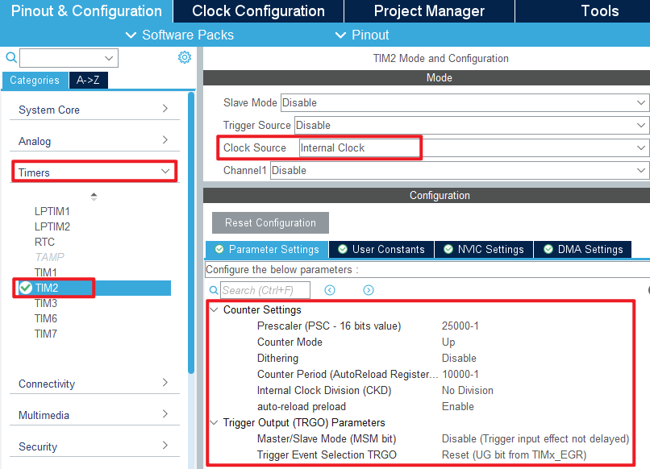
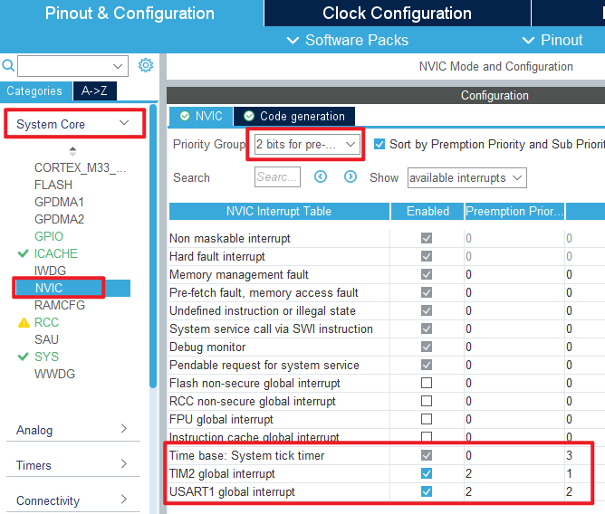

## General-purpose timer interrupt example<a name="brief"></a>

### 1 Brief

The function of this code is to flip the state of the LED in the interrupt service function of the general-purpose timer 2.
### 2 Hardware Hookup
The hardware resources used in this experiment are:
+ LED - PA8
+ USART1 - PA9\PA10
+ TIM2

The TIM2 used in this experiment is the on-chip resource of STM32H503, so there is no corresponding connection schematic diagram.

### 3 STM32CubeIDE Configuration

Let's copy the project from **04_UART** and name both the project and the.ioc file **08_1_GTIM_Interrupt**. Next we start the GTIM configuration by double-clicking the **08_1_GTIM_Interrupt.ioc** file.

Click **Timers->TIM2** and configure as shown in the following figure.



As can be seen from the figure above, we configure the automatic reload value as (10,000-1), the pre-divider value as (25,000-1), and the clock frequency of TIM2 is 250MHz, so the count frequency of TIM2 is 1KHz.

The configuration of the NVIC is shown below.



Click **File > Save**, and you will be asked to generate code.Click **Yes**.

##### code
We add some code to the tim.c file's initialization function ``MX_TIM2_Init``, as follows.
###### tim.c
```c#
  /* USER CODE BEGIN TIM2_Init 2 */
  HAL_TIM_Base_Start_IT(&htim2);    /* Enable timer 2 and its update interrupt. */
  /* USER CODE END TIM2_Init 2 */
```
The above function ``HAL_TIM_Base_Start_IT`` is used to enable TIM2 and start the update interrupt.

An interrupt callback function has also been added, as shown below:
```c#
void HAL_TIM_PeriodElapsedCallback(TIM_HandleTypeDef *htim)
{
  if (htim->Instance == TIM2)
  {
    LED_TOGGLE(); /* turn over LED */
  }
}
```
 The LED is flipped in the update interrupt callback function ``HAL_TIM_PeriodElapsedCallback``. We will determine whether the update is interrupted by TIM2, and if so, perform an LED flip operation.

###### main.c
Only the delay function is called in the while loop of the main function, the code is as follows.
```c#
int main(void)
{
  /* USER CODE BEGIN 1 */

  /* USER CODE END 1 */

  /* MCU Configuration--------------------------------------------------------*/

  /* Reset of all peripherals, Initializes the Flash interface and the Systick. */
  HAL_Init();

  /* USER CODE BEGIN Init */

  /* USER CODE END Init */

  /* Configure the system clock */
  SystemClock_Config();

  /* USER CODE BEGIN SysInit */

  /* USER CODE END SysInit */

  /* Initialize all configured peripherals */
  MX_GPIO_Init();
  MX_ICACHE_Init();
  MX_USART1_UART_Init();
  MX_TIM2_Init();
  /* USER CODE BEGIN 2 */
  stm32h503cb_show_mesg();
  /* USER CODE END 2 */

  /* Infinite loop */
  /* USER CODE BEGIN WHILE */
  while (1)
  {
    HAL_Delay(500);   /* delay 500ms */
    /* USER CODE END WHILE */

    /* USER CODE BEGIN 3 */
  }
  /* USER CODE END 3 */
}
```


### 4 Running
#### 4.1 Compile & Download
After the compilation is complete, connect the DAP and the Mini Board, and then connect to the computer together to download the program to the Mini Board.
#### 4.2 Phenomenon
Press the reset button to restart the Mini Board, open the serial port host computer **ATK-XCOM**, and you can see the experimental prompt message, indicating that the code has been successfully downloaded. Observe the LED flashing every 500 milliseconds on the Mini Board.

[jump to title](#brief)