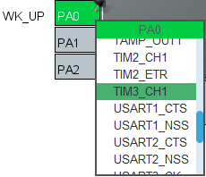
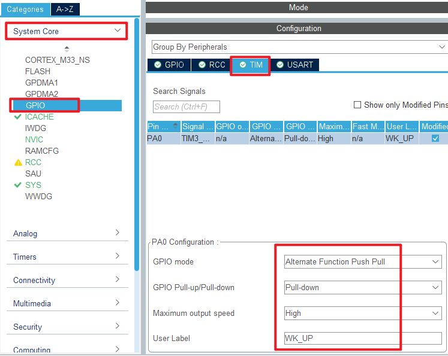
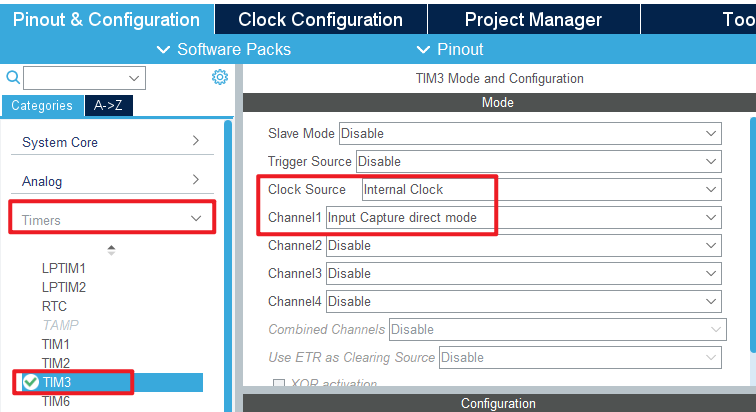
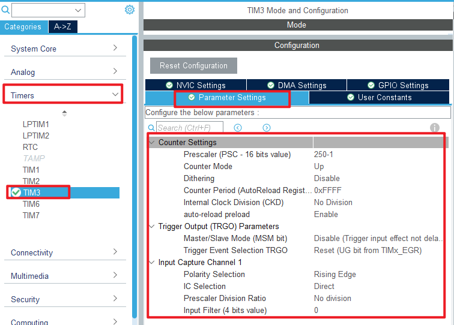
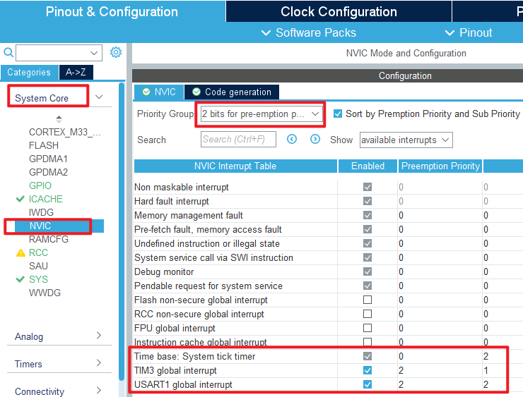
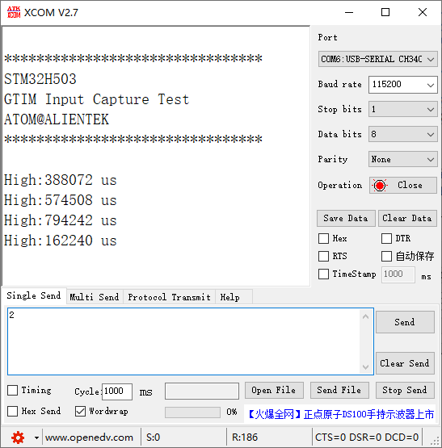

## General-purpose timer input capture example<a name="brief"></a>

### 1 Brief
The function of this program is to capture the pulse time of WKUP key press and pull up PA0, and output it through the serial port.
### 2 Hardware Hookup
The hardware resources used in this experiment are:
+ LED - PA8
+ KEY - WKUP(PA0)
+ USART1 - PA9\PA10
+ TIM3 - channel1(PA0)

The TIM3 used in this experiment is the on-chip resource of STM32H503, so there is no corresponding connection schematic diagram.

### 3 STM32CubeIDE Configuration


Let's copy the project from **04_UART** and name both the project and the.ioc file **08_3_GTIM_Capture**. Next we start the GTIM configuration by double-clicking the **08_3_GTIM_Capture.ioc** file.

First, we multiplexed the PA0 pin to TIM3_CH1, as shown below.



The detailed configuration of pins is as follows.



Click **Timers->TIM3** and configure as shown in the following figure.



The **Parameter Settings** are as follows.



This experiment uses timer input capture interrupt to complete the capture function, so the NVIC configuration is as follows.



Click **File > Save**, and you will be asked to generate code.Click **Yes**.

##### code
We add some code to the tim.c file's initialization function ``MX_TIM3_Init``, as follows:
###### tim.c
```c#
  /* USER CODE BEGIN TIM3_Init 2 */
  __HAL_TIM_ENABLE_IT(&htim3, TIM_IT_UPDATE);     	/* Enable update interrupts */
  HAL_TIM_IC_Start_IT(&htim3, TIM_CHANNEL_1);    	/* Start capturing channel 1 of TIM3 */
  /* USER CODE END TIM3_Init 2 */
```
The above function ``__HAL TIM ENABLE IT`` is used to enable update interrupts. The ``HAL_TIM_IC_Start_IT`` function is used to enable the capture of TIM3_channel 1 and enable the capture interrupt.

Two interrupt callbacks have also been added, as shown below.
```c#
uint8_t g_timxchy_cap_sta = 0;    /* Input capture state. */
uint16_t g_timxchy_cap_val = 0;   /* Input capture value. */

/**
  * @brief  Input Capture callback in non-blocking mode
  * @param  htim TIM IC handle
  * @retval None
  */
void HAL_TIM_IC_CaptureCallback(TIM_HandleTypeDef *htim)
{
    if (htim->Instance == TIM3)
    {
        if ((g_timxchy_cap_sta & 0X80) == 0)                	/* No capture yet. */
        {
            if (g_timxchy_cap_sta & 0X40)                   	/* A falling edge is captured. */
            {
                g_timxchy_cap_sta |= 0X80;                  	/* The marker successfully captured one high level pulse width. */
                g_timxchy_cap_val = HAL_TIM_ReadCapturedValue(htim, TIM_CHANNEL_1);  /* Gets the current capture value. */
                TIM_RESET_CAPTUREPOLARITY(htim, TIM_CHANNEL_1); /* Be sure to clear the original Settings first */
                __HAL_TIM_SET_CAPTUREPOLARITY(htim, TIM_CHANNEL_1, TIM_INPUTCHANNELPOLARITY_RISING);/* Configure TIM3 channel 1 rising edge capture. */
            }
            else /* Not yet started, first capture rising edge */
            {
                g_timxchy_cap_sta = 0;                      	/* clear */
                g_timxchy_cap_val = 0;
                g_timxchy_cap_sta |= 0X40;                     	/* The marker has captured the rising edge. */
                __HAL_TIM_DISABLE(htim);                        /* Turn off timer 3 */
                __HAL_TIM_SET_COUNTER(htim, 0);                 /* Timer 3 The counter is cleared */
                TIM_RESET_CAPTUREPOLARITY(htim, TIM_CHANNEL_1); /* Be sure to clear the original Settings first */
                __HAL_TIM_SET_CAPTUREPOLARITY(htim, TIM_CHANNEL_1, TIM_INPUTCHANNELPOLARITY_FALLING);/* Timer 3 Channel 1 is set to falling edge capture */
                __HAL_TIM_ENABLE(htim);                         /* Enable timer 3 */
            }
        }
    }
}

/**
  * @brief  Period elapsed callback in non-blocking mode
  * @param  htim TIM handle
  * @retval None
  */
void HAL_TIM_PeriodElapsedCallback(TIM_HandleTypeDef *htim)
{
    if (htim->Instance == TIM3)
    {
        if ((g_timxchy_cap_sta & 0X80) == 0)            /* No capture yet */
        {
            if (g_timxchy_cap_sta & 0X40)               /* High levels have been captured */
            {
                if ((g_timxchy_cap_sta & 0X3F) == 0X3F) /* The high level is too long */
                {
                    TIM_RESET_CAPTUREPOLARITY(htim, TIM_CHANNEL_1); /* Be sure to clear the original Settings first */
                    __HAL_TIM_SET_CAPTUREPOLARITY(htim, TIM_CHANNEL_1, TIM_INPUTCHANNELPOLARITY_RISING);/* Configure TIM3 channel 1 rising edge capture */
                    g_timxchy_cap_sta |= 0X80;          /* The tag was successfully captured once */
                    g_timxchy_cap_val = 0XFFFF;
                }
                else      /* Accumulate the number of timer overflows */
                {
                    g_timxchy_cap_sta++;
                }
            }
        }
    }
}
```
The above two interrupt callbacks handle the main logic we captured.The TIM3 interrupt callback function captures the rising and falling edge of the input signal in turn, and clears the TIM3 count when the rising edge is captured for the first time.Then, when the falling edge of the signal is captured, the count value of TIM3 is read, which is the count value corresponding to the high pulse width of the input signal. As long as the count frequency of TIM3 is used, the time of the high pulse width of the input signal can be calculated. The update interrupt of TIM3 is used to handle count overflow.

###### main.c
The specific code of the main function is as follows:
```c#
int main(void)
{
  /* USER CODE BEGIN 1 */
  uint32_t temp = 0;
  uint8_t t = 0;
  /* USER CODE END 1 */

  /* MCU Configuration--------------------------------------------------------*/

  /* Reset of all peripherals, Initializes the Flash interface and the Systick. */
  HAL_Init();

  /* USER CODE BEGIN Init */

  /* USER CODE END Init */

  /* Configure the system clock */
  SystemClock_Config();

  /* USER CODE BEGIN SysInit */

  /* USER CODE END SysInit */

  /* Initialize all configured peripherals */
  MX_GPIO_Init();
  MX_ICACHE_Init();
  MX_USART1_UART_Init();
  MX_TIM3_Init();
  /* USER CODE BEGIN 2 */
  stm32h503cb_show_mesg();
  /* USER CODE END 2 */

  /* Infinite loop */
  /* USER CODE BEGIN WHILE */
  while (1)
  {
    if (g_timxchy_cap_sta & 0X80)       /* A high level was successfully captured. */
    {
        temp = g_timxchy_cap_sta & 0X3F;
        temp *= 65536;                  /* Total overflow time */
        temp += g_timxchy_cap_val;      /* Get the total high time. */
        printf("High:%u us\r\n", (unsigned int)temp); /* Print the total peak time */
        g_timxchy_cap_sta = 0;          /* Enable the next capture. */
    }
    t++;
    if (t > 20)                         /* Enter once in 200ms */
    {
        t = 0;
        LED_TOGGLE();                   /* turn over LED */
    }

    HAL_Delay(10);                      /* delay 10ms */
    /* USER CODE END WHILE */

    /* USER CODE BEGIN 3 */
  }
  /* USER CODE END 3 */
}
```
After the previous configuration, the counting frequency of TIM3 is 1MHz, that is, one count per microsecond, so our capture time accuracy is 1 microsecond. The timer overflow time is 65,536 microseconds. The seventh bit of ``g_timxchy_cap_sta`` is judged in the while loop to know whether a high level has been successfully captured. If it is successfully captured, the total high level time is calculated first, and then transmitted to the computer through the serial port.


### 4 Running
#### 4.1 Compile & Download
After the compilation is complete, connect the DAP and the Mini Board, and then connect to the computer together to download the program to the Mini Board.
#### 4.2 Phenomenon
Press the reset button to restart the Mini Board, and observe the LED flashing on the Mini Board, indicating that the code has been downloaded successfully. Open the serial port host computer **ATK-XCOM** can see the experiment prompt information, and press the WKUP button, see the serial port printed high level duration, as shown below:



[jump to title](#brief)