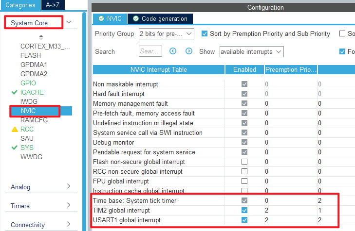

## General-purpose timer pulse count example<a name="brief"></a>

### 1 Brief
The function of this code is to capture the number of pulses generated by the key press of WKUP and output it through the serial port. Press the KEY0 key to reset the statistics.
### 2 Hardware Hookup
The hardware resources used in this experiment are:
+ LED - PA8
+ KEY - WKUP(PA0)
+ KEY - KEY0(PC13)
+ USART1 - PA9\PA10
+ TIM2 - channel1(PA0)

The TIM2 used in this experiment is the on-chip resource of STM32H503, so there is no corresponding connection schematic diagram.

### 3 STM32CubeIDE Configuration


Let's copy the project from **04_UART** and name both the project and the.ioc file **08_4_GTIM_Count**. Next we start the GTIM configuration by double-clicking the **08_4_GTIM_Count.ioc** file.

First we multiplex the PA0 pin into TIM2_CH1 as shown below.


The detailed configuration of pins is as follows.


Click **Timers > TIM2** and configure as shown in the following figure.


In this experiment, the timer update interrupt is used to complete the function of cumulative overflow times, so the NVIC configuration is as follows.



Click **File > Save**, and you will be asked to generate code.Click **Yes**.

##### code
We add some code to the tim.c file's initialization function ``MX_TIM2_Init``, as follows:
###### tim.c
```c#
  /* USER CODE BEGIN TIM2_Init 2 */
  __HAL_TIM_ENABLE_IT(&htim2, TIM_IT_UPDATE);   /* Enable update interrupts. */
  HAL_TIM_IC_Start(&htim2, TIM_CHANNEL_1);      /* Start capturing the channel y of TIMx. */
  /* USER CODE END TIM2_Init 2 */
```
The function ``__HAL_TIM_ENABLE_IT`` and the function ``HAL_TIM_IC_Start`` described above enable the capture of TIM2_channel 1 and enable the update interrupt.

We also add some functions, like this:
```c#
/* The overflow times of the timer counter are recorded to
 * facilitate the calculation of the total number of pulses */
uint32_t g_timxchy_cnt_ofcnt = 0 ;           /* number of overflow */

/**
 * @brief    The generic timer TIMX channel Y gets the current count value
 * @param    None.
 * @retval   Count value.
 */
uint32_t gtim_timx_cnt_chy_get_count(void)
{
  uint32_t count = 0;
  count = g_timxchy_cnt_ofcnt * 65536;     /* Calculate the count corresponding to the number of overflows. */
  count += __HAL_TIM_GET_COUNTER(&htim2);  /* Add the current value of count. */
  return count;
}

/**
 * @brief    The generic timer TIMX channel Y restarts the counter.
 * @param    None.
 * @retval   None.
 */
void gtim_timx_cnt_chy_restart(void)
{
  __HAL_TIM_DISABLE(&htim2);          /* Close TIMX. */
  g_timxchy_cnt_ofcnt = 0;            /* The accumulator is reset. */
  __HAL_TIM_SET_COUNTER(&htim2, 0);   /* Clear the counter. */
  __HAL_TIM_ENABLE(&htim2);           /* Enable TIM2. */
}

/**
  * @brief  Period elapsed callback in non-blocking mode
  * @param  htim TIM handle
  * @retval None
  */
void HAL_TIM_PeriodElapsedCallback(TIM_HandleTypeDef *htim)
{
  if (htim->Instance == TIM2)
  {
    g_timxchy_cnt_ofcnt++;          /* Cumulative overflow times */
  }
}
```
The function ``gtim_timx_cnt_chy_get_count`` is used to calculate the value of the counter to know the number of high pulses recorded by the counter.
The function ``gtim_timx_cnt_chy_restart`` is used to restart the counter, which is called after KEY0 is pressed.
In the final update interrupt callback, the number of overflows is recorded.

###### main.c
Here's the main function:
```c#
int main(void)
{
  /* USER CODE BEGIN 1 */
  uint32_t curcnt = 0;
  uint32_t oldcnt = 0;
  uint8_t key = 0;
  uint8_t t = 0;
  /* USER CODE END 1 */

  /* MCU Configuration--------------------------------------------------------*/

  /* Reset of all peripherals, Initializes the Flash interface and the Systick. */
  HAL_Init();

  /* USER CODE BEGIN Init */

  /* USER CODE END Init */

  /* Configure the system clock */
  SystemClock_Config();

  /* USER CODE BEGIN SysInit */

  /* USER CODE END SysInit */

  /* Initialize all configured peripherals */
  MX_GPIO_Init();
  MX_ICACHE_Init();
  MX_USART1_UART_Init();
  MX_TIM2_Init();
  /* USER CODE BEGIN 2 */
  stm32h503cb_show_mesg();
  gtim_timx_cnt_chy_restart();              /* Restart counting. */
  /* USER CODE END 2 */

  /* Infinite loop */
  /* USER CODE BEGIN WHILE */
  while (1)
  {
    key = key_scan(0);                      /* scan key */

    if (key == KEY0_PRES)                   /* KEY0 is pressed to restart the count */
    {
        gtim_timx_cnt_chy_restart();        /* Restart counting. */
    }

    curcnt = gtim_timx_cnt_chy_get_count(); /* Getting the count. */

    if (oldcnt != curcnt)
    {
        oldcnt = curcnt;
        printf("CNT:%lu\r\n", oldcnt);      /* Print the number of pulses. */
    }

    t++;

    if (t > 20)                             /* Enter once in 200ms. */
    {
        t = 0;
        LED_TOGGLE();                       /* LED blinks to prompt the program to run */
    }

    HAL_Delay(10);                          /* delay 10ms */
    /* USER CODE END WHILE */

    /* USER CODE BEGIN 3 */
  }
  /* USER CODE END 3 */
}
```
In the code, if the KEY0 key is pressed, the count of TIM2 is reset. If the WKUP button is pressed, the count value will be triggered to add 1, and the new count value will be transmitted to the serial debugging assistant through the serial port.


### 4 Running
#### 4.1 Compile & Download
After the compilation is complete, connect the DAP and the Mini Board, and then connect to the computer together to download the program to the Mini Board.
#### 4.2 Phenomenon
Press the reset button to restart the Mini Board, and observe the LED flashing on the Mini Board, indicating that the code has been downloaded successfully. Open the serial port host computer **ATK-XCOM** can see the experimental prompt information, continuously press the WKUP button, simulate multiple pulses, and then press the KEY0 button to clear the count value, as shown below:


[jump to title](#brief)