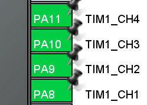
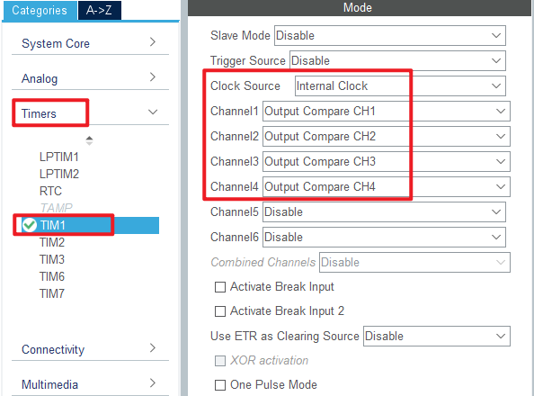
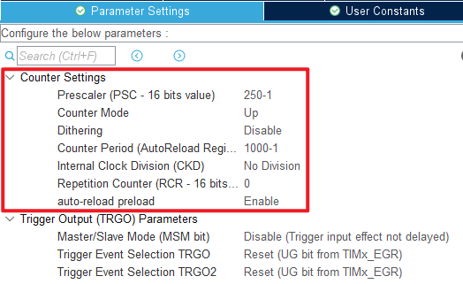
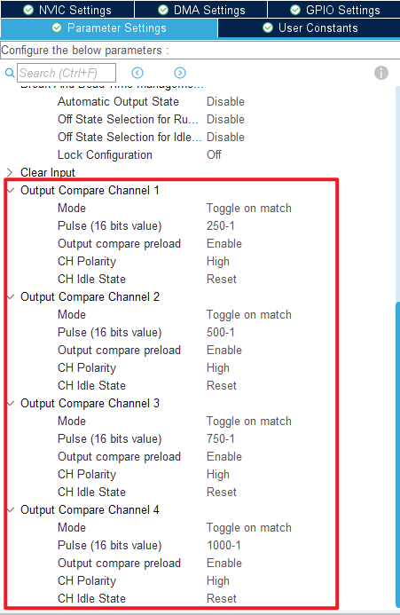
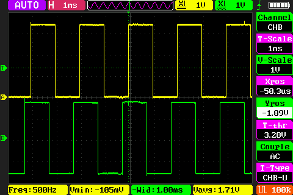

## Advanced timer output comparison mode example<a name="brief"></a>

### 1 Brief
The function of this code is the timer 1 channels 1, 2, 3 and 4 output PWM with phase of 25%, 50%, 75% and 100% and duty cycle of 50%, respectively.
### 2 Hardware Hookup
The hardware resources used in this experiment are:
+ TIM1-channel1(PA8)
+ TIM1-channel2(PA9)
+ TIM1-channel3(PA10)
+ TIM1-channel4(PA11)
+ ALIENTEK DS100 oscilloscope

The TIM1 used in this experiment is the on-chip resource of STM32H503, so there is no corresponding connection schematic diagram.

### 3 STM32CubeIDE Configuration


Let's copy the project from **04_UART** and name both the project and the.ioc file **09_2_ATIM_Compare**. Next we start the ATIM configuration by double-clicking the **09_2_ATIM_Compare.ioc** file.

First, we will reuse pins PA8 through PA11 as TIM1_CH1 through TIM1_CH4 in a similar way as we did in the previous chapter, as shown in the following figure:




Click **Timers > TIM1** and configure as shown in the following figure.



Click **Timers > TIM1 > Parameter Settings** .





Click **File > Save** and click **Yes** to generate code.

##### code
We add some code to the tim.c file's initialization function ``MX_TIM1_Init``, as follows:
###### tim.c
```c#
  /* USER CODE BEGIN TIM1_Init 2 */
  HAL_TIM_OC_Start(&htim1, TIM_CHANNEL_1);
  HAL_TIM_OC_Start(&htim1, TIM_CHANNEL_2);
  HAL_TIM_OC_Start(&htim1, TIM_CHANNEL_3);
  HAL_TIM_OC_Start(&htim1, TIM_CHANNEL_4);
  /* USER CODE END TIM1_Init 2 */
```
The above function ``HAL_TIM_OC_Start`` is used to enable the output of TIM1 channels 1-4.

###### main.c
In the while loop of main, only the delayed function is called, as follows:
```c#
int main(void)
{
  /* USER CODE BEGIN 1 */

  /* USER CODE END 1 */

  /* MCU Configuration--------------------------------------------------------*/

  /* Reset of all peripherals, Initializes the Flash interface and the Systick. */
  HAL_Init();

  /* USER CODE BEGIN Init */

  /* USER CODE END Init */

  /* Configure the system clock */
  SystemClock_Config();

  /* USER CODE BEGIN SysInit */

  /* USER CODE END SysInit */

  /* Initialize all configured peripherals */
  MX_GPIO_Init();
  MX_ICACHE_Init();
  MX_TIM1_Init();
  /* USER CODE BEGIN 2 */

  /* USER CODE END 2 */

  /* Infinite loop */
  /* USER CODE BEGIN WHILE */
  while (1)
  {
    HAL_Delay(10);     /* delay 10ms */
    /* USER CODE END WHILE */

    /* USER CODE BEGIN 3 */
  }
  /* USER CODE END 3 */
}
```


### 4 Running
#### 4.1 Compile & Download
After the compilation is complete, connect the DAP and the Mini Board, and then connect to the computer together to download the program to the Mini Board.
#### 4.2 Phenomenon
Press the reset button to restart the Mini Board. We need to observe the PWM output of PA8, PA9, PA10 and PA11 pins with the help of an oscilloscope. The phases of these 4-channel PWMS differ by 25% pairwise.

Here, we use ALIENTEK DS100 oscilloscope to observe the waveforms of PA8 and PA9. The yellow waveform is that of PA8, and the green waveform is that of PA9.



[jump to title](#brief)
