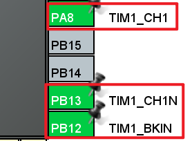
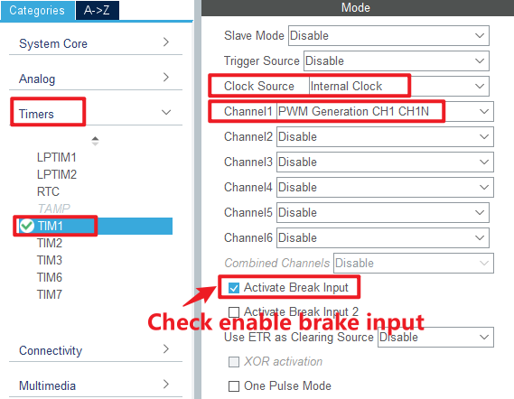
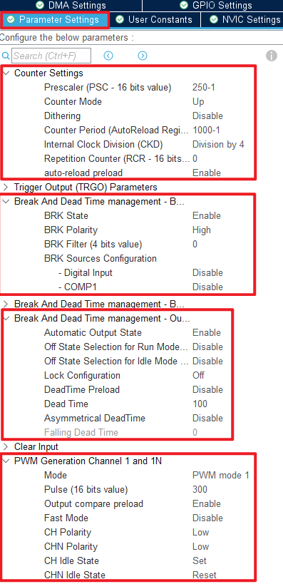
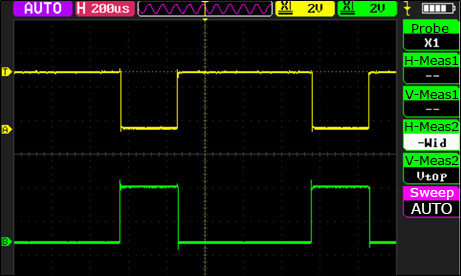
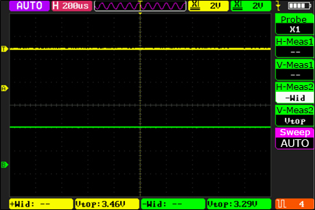

## Advanced timer complementary output with dead zone control example<a name="brief"></a>

### 1 Brief
The function of this code is TIM1_channel_1 and its complementary channel output frequency of 1 KHZ, the duty cycle of 30% PWM, and with dead zone control. When the brake input pin of TIM1 is pulled high, the brake time is generated, that is, TIM1 stops the output PWM.
### 2 Hardware Hookup
The hardware resources used in this experiment are:
+ LED - PA8
+ TIM1 - channel1(PA8)
+ TIM1 - Complementary channel1(PB13)
+ TIM1 - Brake input(PB12)
+ ALIENTEK DS100 oscilloscope

The TIM1 used in this experiment is the on-chip resource of STM32H503, so there is no corresponding connection schematic diagram.

### 3 STM32CubeIDE Configuration


Let's copy the project from the **04_UART** and name both the project and the.ioc file **09_3_ATIM_CPLM_PWM**. Next we start the ATIM configuration by double-clicking the **09_3_ATIM_CPLM_PWM.ioc** file.

First, we will configure the pin as shown below:



Click **Timers > TIM1** and configure as shown in the following figure.



Click **Timers > TIM1 > Parameter Settings** .



Click **File > Save**, and you will be asked to generate code.Click **Yes**.

##### code
We add some code to the tim.c file's initialization function ``MX_TIM1_Init``, as follows:
###### tim.c
```c#
  /* USER CODE BEGIN TIM1_Init 2 */
  HAL_TIM_PWM_Start(&htim1, TIM_CHANNEL_1);         /* Enable OCy output. */
  HAL_TIMEx_PWMN_Start(&htim1, TIM_CHANNEL_1);      /* Enable OCyN output. */
  /* USER CODE END TIM1_Init 2 */
```
The above function is used to start the channel output and the complementary channel output.

###### main.c
In the while loop of main, only the delayed function is called, as follows:
```c#
int main(void)
{
  /* USER CODE BEGIN 1 */

  /* USER CODE END 1 */

  /* MCU Configuration--------------------------------------------------------*/

  /* Reset of all peripherals, Initializes the Flash interface and the Systick. */
  HAL_Init();

  /* USER CODE BEGIN Init */

  /* USER CODE END Init */

  /* Configure the system clock */
  SystemClock_Config();

  /* USER CODE BEGIN SysInit */

  /* USER CODE END SysInit */

  /* Initialize all configured peripherals */
  MX_GPIO_Init();
  MX_ICACHE_Init();
  MX_TIM1_Init();
  MX_USART1_UART_Init();
  /* USER CODE BEGIN 2 */
  stm32h503cb_show_mesg();
  /* USER CODE END 2 */

  /* Infinite loop */
  /* USER CODE BEGIN WHILE */
  while (1)
  {
    HAL_Delay(10);     /* delay 10ms */
    /* USER CODE END WHILE */

    /* USER CODE BEGIN 3 */
  }
  /* USER CODE END 3 */
}
```


### 4 Running
#### 4.1 Compile & Download
After the compilation is complete, connect the DAP and the Mini Board, and then connect to the computer together to download the program to the Mini Board.
#### 4.2 Phenomenon
Press the reset button to restart the Mini Board, open the serial port debugging assistant will print the experimental information, indicating that the program has been downloaded successfully.

We need to observe the situation of PA8 and PB13 pin PWM output with the help of a ALIENTEK DS100 oscilloscope, and find that these two PWMS are complementary PWMS, as shown in the figure.



Since the brake and automatic output functions are set, after the PB12 pin is connected to the effective high level, it can be seen that both PWMS are forbidden to output. When the high level of PB12 pin access is revoked, you can see that the two PWM output is automatically restored, as shown below:



[jump to title](#brief)
