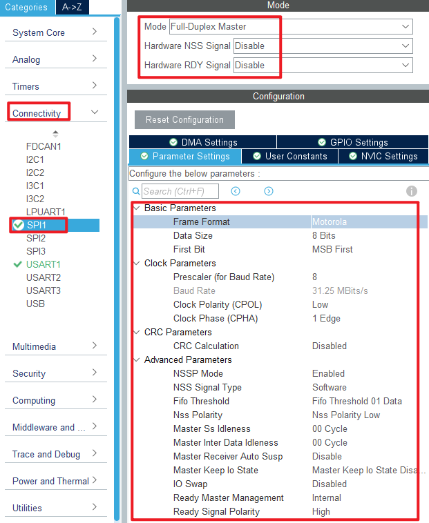

## TFTLCD_MCU example<a name="brief"></a>

### 1 Brief
The function of this code is to use a 1.3 inch screen to display experimental information.
### 2 Hardware Hookup
The hardware resources used in this experiment are:
+ LED - PA8
+ USART1 - PA9\PA10
+ SPI1 - SCK(PA5)
+ SPI1 - MOSI(PA7)
+ ALIENTEK 1.3-inch TFTLCD module(MCU screen only, SPI interface driver)

The SPI1 used in this experiment is an on-chip resource of STM32H503, so there is no corresponding connection schematic. The wiring diagram between MCU and ATK-MD0130 module is shown as follows:


### 3 STM32CubeIDE Configuration


Let's copy the project from  **04_UART** and name both the project and the.ioc file **10_TFTLCD_MCU**. Next we start the TFTLCD_MCU configuration by double-clicking the **10_TFTLCD_MCU.ioc** file.

First of all, the following are the pins used in this experiment. The red box is the relevant pin of SPI, which is set as shown below:


The remaining pins are configured as follows:


Click **Connectivity > SPI1** .



Click **File > Save**, and you will be asked to generate code.Click **Yes**.

##### code
We added some code to the spi.c file as follows:
###### spi.c
```c#
  void spi1_write_data(uint8_t *tx_data, uint16_t size)
  {
    HAL_SPI_Transmit(&hspi1, tx_data, size, HAL_MAX_DELAY);
  }
```
The above function transfers one byte of data using SPI.

###### lcd.c
In addition, this experiment will add an LCD driver file written by the ALIENTEK team. We won't post all the code here, you can open the source code to view. Let's focus on the following LCD functions, as follows:
```c#
/**
 * @brief   LCD underlying SPI data sending function
 * @param   data : The starting address of the data
 * @param   size : Send data size
 * @retval  None.
 */
static void lcd_spi_send(uint8_t *data, uint32_t size)
{
    uint32_t i;
    uint32_t delta;
    LCD_CS(0);                          /* Enable slice selection */
    delta = size / 0xFFFF;

    for (i = 0; i <= delta; i ++)
    {
        if ( i == delta )               /* The last frame is sent */
        {
            spi1_write_data(&data[i * 0xFFFF], size%0xFFFF);
        }
        else                            /* Very-long data sends 0xFFFF bytes of data at a time */
        {
            spi1_write_data(&data[i * 0xFFFF], 0xFFFF);
        }
    }
    LCD_CS(1);                          /* Disable slice selection */
}

/**
 * @brief   Writes commands to LCD
 * @param   cmd : Commands to send
 * @retval  None.
 */
static void lcd_write_cmd(uint8_t cmd)
{
    LCD_WR(0);

    lcd_spi_send(&cmd, 1);
}

/**
 * @brief   Writes data to LCD
 * @param   cmd : data to send
 * @retval  None.
 */
static void lcd_write_data(uint8_t data)
{
    LCD_WR(1);

    lcd_spi_send(&data, 1);
}
```
All three functions call the ``lcd_spi_send`` function to send data to the LCD.

###### main.c
In the while loop of main, only the delayed function is called, as follows:
```c#
int main(void)
{
  /* USER CODE BEGIN 1 */

  /* USER CODE END 1 */

  /* MCU Configuration--------------------------------------------------------*/

  /* Reset of all peripherals, Initializes the Flash interface and the Systick. */
  HAL_Init();

  /* USER CODE BEGIN Init */

  /* USER CODE END Init */

  /* Configure the system clock */
  SystemClock_Config();

  /* USER CODE BEGIN SysInit */

  /* USER CODE END SysInit */

  /* Initialize all configured peripherals */
  MX_GPIO_Init();
  MX_ICACHE_Init();
  MX_SPI1_Init();
  MX_USART1_UART_Init();
  /* USER CODE BEGIN 2 */
  stm32h503cb_show_mesg();
  lcd_init();
  lcd_show_string(0, 5, 240, 32, 32, "STM32H503CBT6", RED);
  lcd_show_string(0, 34, 240, 24, 24, "ATK-MD0130", RED);
  lcd_show_string(0, 60, 240, 16, 16, "ATOM@ALIENTEK", RED);
  /* USER CODE END 2 */

  /* Infinite loop */
  /* USER CODE BEGIN WHILE */
  while (1)
  {
    LED_TOGGLE();       /* LED state is flipped */
    HAL_Delay(500);
    /* USER CODE END WHILE */

    /* USER CODE BEGIN 3 */
  }
  /* USER CODE END 3 */
}
```
The driving LED blinks in the while loop to indicate that the experiment is running.


### 4 Running
#### 4.1 Compile & Download
After the compilation is complete, connect the DAP and the Mini Board, and then connect to the computer together to download the program to the Mini Board.
#### 4.2 Phenomenon
Press the reset button to restart the Mini Board, observe the LED flashing on the Mini Board, open the serial port and the host computer **ATK-XCOM** can see the prompt information of the experiment, indicating that the code download is successful. Connecting the **ATK-MD0130** module and the Mini Board, the phenomenon is shown as follows.


[jump to title](#brief)