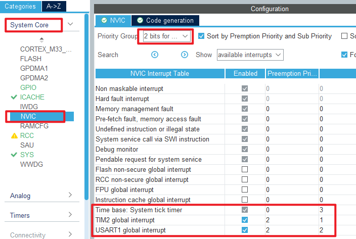

## USMART example<a name="brief"></a>


### 1 Brief
The function of this code is to call the function in the program through USMART to realize the state control of the LED.
### 2 Hardware Hookup
The hardware resources used in this experiment are:
+ LED - PA8
+ USART1 - PA9\PA10
+ TIM2

The USMART components used in this experiment are application software, so there is no corresponding connection schematic.

### 3 STM32CubeIDE Configuration


Let's copy the project from  **04_UART** and name both the project and the.ioc file **11_USMART**. Next we start the configuration by double-clicking the **11_USMART.ioc** file.

TIM2 is used in this experiment. Click **Timers > TIM2** and set it as shown below:


The TIM2 used in this experiment will overflow every 1 ms to generate an interrupt, so the configuration of the NVIC is shown as follows:



Click **File > Save**, and you will be asked to generate code.Click **Yes**.

In this experiment, the USMART folder will be ported, which contains the following files:


##### code
###### usmart_port.c
Porting USMART components is as simple as implementing the four functions in this file, which are explained below:
```c#
/**
 * @brief      Get the input data stream (string)
 * @note       USMART parses the string returned by the function for information such as the function name and arguments
 * @param      none
 * @retval
 * @arg        0, no data received
 * @arg        Other, stream start address (cannot be 0)
 */
char *usmart_get_input_string(void)
{
  uint8_t len;
  char *pbuf = 0;

  if (g_usart_rx_sta & 0x8000)      /* Complete serial port reception? */
  {
    len = g_usart_rx_sta & 0x3fff;  /* Get the length of the received data */
    g_usart_rx_buf[len] = '\0';     /* Add the terminator at the end. */
    pbuf = (char*)g_usart_rx_buf;
    g_usart_rx_sta = 0;             /* Enable next reception */
  }

  return pbuf;
}
```
As you can see from the preceding code, this function gets the input data from the serial port.

```c#
void usmart_timx_reset_time(void)
{
  __HAL_TIM_CLEAR_FLAG(&htim2, TIM_FLAG_UPDATE); /* Clear the interrupt flag bit */
  __HAL_TIM_SET_AUTORELOAD(&htim2, 0XFFFF);      /* Set the reload value to the maximum */
  __HAL_TIM_SET_COUNTER(&htim2, 0);              /* Clear counter */
  usmart_dev.runtime = 0;
}
```
This function resets the runtime functionality and the associated TMR used for the runtime functionality.

```c#
uint32_t usmart_timx_get_time(void)
{
  if (__HAL_TIM_GET_FLAG(&htim2, TIM_FLAG_UPDATE) == SET)  /* During the run, a timer overflow occurs */
  {
    usmart_dev.runtime += 0XFFFF;
  }
  usmart_dev.runtime += __HAL_TIM_GET_COUNTER(&htim2);
  return usmart_dev.runtime;                               /* Return count value */
}
```
The function is capable of handling a single timer overflow, so the maximum amount of time that can be obtained is twice the maximum timer count.

```c#
void TIM2_IRQHandler(void)
{
  /* overflow trap */
  if(__HAL_TIM_GET_IT_SOURCE(&htim2,TIM_IT_UPDATE)==SET)
  {
    usmart_dev.scan();                        /* usmart scan */
    __HAL_TIM_SET_COUNTER(&htim2, 0);;        /* Clear counter */
    __HAL_TIM_SET_AUTORELOAD(&htim2, 100);    /* Restore the original Settings */
  }
  __HAL_TIM_CLEAR_IT(&htim2,  TIM_IT_UPDATE);				/* Clear the interrupt flag bit */
}
```
Note that since the interrupt service function is also defined in ``stm32h5xx_it.c``, the definition in ``stm32h5xx_it.c`` should be masked, as shown in the following figure:


Now that the porting of the USMART component is almost complete, you can add the debug functions to the **usmart_nametab** array in the ``usmart_config.c`` file .

###### main.c
In the while loop of main, only the delayed function is called, as follows:
```c#
int main(void)
{
  /* USER CODE BEGIN 1 */

  /* USER CODE END 1 */

  /* MCU Configuration--------------------------------------------------------*/

  /* Reset of all peripherals, Initializes the Flash interface and the Systick. */
  HAL_Init();

  /* USER CODE BEGIN Init */

  /* USER CODE END Init */

  /* Configure the system clock */
  SystemClock_Config();

  /* USER CODE BEGIN SysInit */

  /* USER CODE END SysInit */

  /* Initialize all configured peripherals */
  MX_GPIO_Init();
  MX_ICACHE_Init();
  MX_USART1_UART_Init();
  MX_TIM2_Init();
  /* USER CODE BEGIN 2 */
  stm32h503cb_show_mesg();
  /* USER CODE END 2 */

  /* Infinite loop */
  /* USER CODE BEGIN WHILE */
  while (1)
  {
    HAL_Delay(500);   		 /* delay 500ms */
    /* USER CODE END WHILE */

    /* USER CODE BEGIN 3 */
  }
  /* USER CODE END 3 */
}
```

There are two separate lines of code to add, as shown here:
```c#
/* LED state setting function */
void led_set(uint8_t sta)
{
    LED(sta);
}

/* Function arguments call the test function */
void test_fun(void(*ledset)(uint8_t), uint8_t sta)
{
    ledset(sta);
}
```
The ``led_set`` function is used to set the state of the LED. The second function, ``test_fun``, tests USMART's support for function arguments.


### 4 Running
#### 4.1 Compile & Download
After the compilation is complete, connect the DAP and the Mini Board, and then connect to the computer together to download the program to the Mini Board.
#### 4.2 Phenomenon
Press the reset button to restart the Mini Board, observe the LED flashing on the Mini Board, open the serial port and the host computer **ATK-XCOM** can see the prompt information of the experiment, indicating that the code download is successful. We send instructions to complete the response function, as shown in the following figure:


You can also send help to get help, as shown in the following screenshot.


[jump to title](#brief)