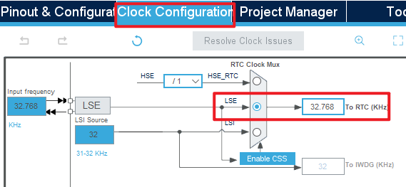
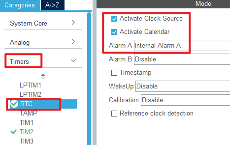
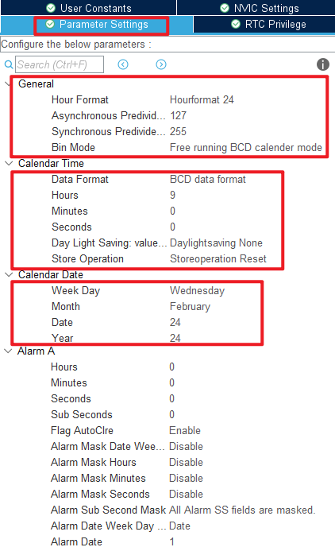
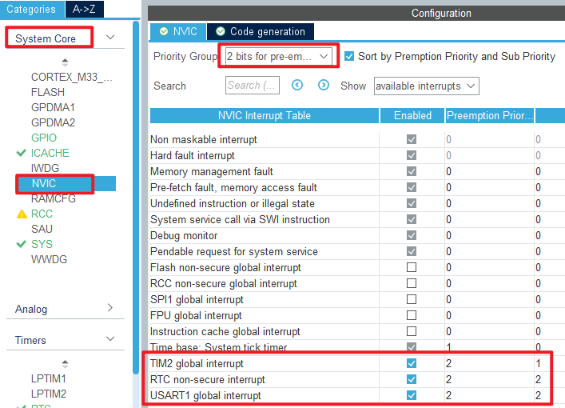
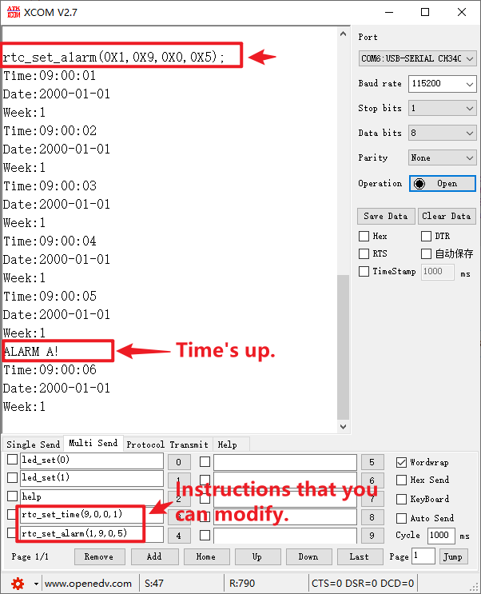

## RTC example<a name="brief"></a>

### 1 Brief
The function of this code is to generate an RTC wake-up interrupt every second.
### 2 Hardware Hookup
The hardware resources used in this experiment are:
+ LED - PA8
+ USART1 - PA9\PA10
+ RTC
+ ALIENTEK 1.3-inch TFTLCD module(MCU screen only, SPI interface driver)

The RTC used in this experiment is the on-chip resource of STM32H503, so there is no corresponding connection schematic.

### 3 STM32CubeIDE Configuration


Let's copy the project from  **10_TFTLCD_MCU** and name both the project and the.ioc file **12_RTC**. Next we start the RTC configuration by double-clicking the **12_RTC.ioc** file.

First click **Clock Configuration** and set it as shown below.



Open **Timers > RTC** as shown below.





Open **NVIC** configuration as shown below.



Click **File > Save**, and you will be asked to generate code.Click **Yes**.

##### code
###### rtc.c
We added a lot of code to rtc.c, so you can open the source code to have a look, but here are the important ones:
```c#
HAL_StatusTypeDef rtc_set_time(uint8_t hour, uint8_t min, uint8_t sec, uint8_t ampm)
{
  RTC_TimeTypeDef sTime = {0};

  sTime.Hours = hour;
  sTime.Minutes = min;
  sTime.Seconds = sec;
  sTime.TimeFormat = ampm;
  sTime.DayLightSaving = RTC_DAYLIGHTSAVING_NONE;
  sTime.StoreOperation = RTC_STOREOPERATION_RESET;

  return HAL_RTC_SetTime(&hrtc, &sTime, RTC_FORMAT_BIN);
}
```
The preceding function is used to set a time.We input a time that will be used as a baseline for subsequent calculations.

```c#
void rtc_set_wakeup(uint8_t wksel, uint16_t cnt)
{
  __HAL_RTC_WAKEUPTIMER_CLEAR_FLAG(&hrtc, RTC_FLAG_WUTF);  /* Clear the RTC WAKE UP flag */

  HAL_RTCEx_SetWakeUpTimer_IT(&hrtc, cnt, wksel, 0);       /* Set the reload value and clock */
}

/**
  * @brief  Alarm A secure callback.
  * @param  hrtc RTC handle
  * @retval None
  */
void HAL_RTC_AlarmAEventCallback(RTC_HandleTypeDef *hrtc)
{
  printf("ALARM A!\r\n");
}

/**
  * @brief  Wake Up Timer callback.
  * @param  hrtc RTC handle
  * @retval None
  */
void HAL_RTCEx_WakeUpTimerEventCallback(RTC_HandleTypeDef *hrtc)
{
  printf("WakeUp!\r\n");
}
```
The latter two functions call the HAL library interrupt public handler function for handling the alarm interrupt.
The function ``HAL_RTC_AlarmAEventCallback`` calls the printf function to print a string ``ALARM A!``.
The function ``HAL_RTCEx_WakeUpTimerEventCallback`` is used to handle wakeup interrupts. When an interrupt occurs, with this function, print the string ``WakeUp!``.

###### main.c
In the while loop of the main function, we will read the RTC time and date every 100 milliseconds, as follows:
```c#
int main(void)
{
  /* USER CODE BEGIN 1 */
  uint8_t hour, min, sec, ampm;
  uint8_t year, month, date, week;
  uint8_t tbuf[40];
  uint8_t t = 0;
  /* USER CODE END 1 */

  /* MCU Configuration--------------------------------------------------------*/

  /* Reset of all peripherals, Initializes the Flash interface and the Systick. */
  HAL_Init();

  /* USER CODE BEGIN Init */

  /* USER CODE END Init */

  /* Configure the system clock */
  SystemClock_Config();

  /* USER CODE BEGIN SysInit */

  /* USER CODE END SysInit */

  /* Initialize all configured peripherals */
  MX_GPIO_Init();
  MX_ICACHE_Init();
  MX_SPI1_Init();
  MX_USART1_UART_Init();
  MX_RTC_Init();
  MX_TIM2_Init();
  /* USER CODE BEGIN 2 */
  stm32h503cb_show_mesg();
  lcd_init();                        	/* Initialize LCD */
  lcd_show_string(30, 50, 200, 16, 16, "STM32", RED);
  lcd_show_string(30, 70, 200, 16, 16, "RTC TEST", RED);
  lcd_show_string(30, 90, 200, 16, 16, "ATOM@ALIENTEK", RED);
  /* USER CODE END 2 */

  /* Infinite loop */
  /* USER CODE BEGIN WHILE */
  while (1)
  {
    t++;

    if ((t % 10) == 0)       /* The display data is updated every 100ms */
    {
        rtc_get_time(&hour, &min, &sec, &ampm);
        sprintf((char *)tbuf, "Time:%02d:%02d:%02d", hour, min, sec);
        printf("%s\r\n",tbuf);
        lcd_show_string(30, 130, 210, 16, 16, (char *)tbuf, RED);

        rtc_get_date(&year, &month, &date, &week);
        sprintf((char *)tbuf, "Date:20%02d-%02d-%02d", year, month, date);
        printf("%s\r\n",tbuf);
        lcd_show_string(30, 150, 210, 16, 16, (char *)tbuf, RED);
        sprintf((char *)tbuf, "Week:%d", week);
        printf("%s\r\n",tbuf);
        lcd_show_string(30, 170, 210, 16, 16, (char *)tbuf, RED);
    }
    HAL_Delay(100);
    /* USER CODE END WHILE */

    /* USER CODE BEGIN 3 */
  }
  /* USER CODE END 3 */
}
```
The driving LED blinks in the while loop to indicate that the experiment is in progress.

###### usmart_port.c
In order to facilitate the call verification of RTC-related functions, **usmart_nametab** is modified in this file as follows:
```c#
struct _m_usmart_nametab usmart_nametab[] =
{
#if USMART_USE_WRFUNS == 1      /* If read and write operations are enabled */
  {(void *)read_addr, "uint32_t read_addr(uint32_t addr)"},
  {(void *)write_addr, "void write_addr(uint32_t addr,uint32_t val)"},
#endif
  {(void *)rtc_read_bkr, "uint32_t rtc_read_bkr(uint32_t bkrx)"},
  {(void *)rtc_write_bkr, "void rtc_write_bkr(uint32_t bkrx, uint32_t data)"},
  {(void *)rtc_set_time, "uint8_t rtc_set_time(uint8_t hour, uint8_t min, uint8_t sec, uint8_t ampm)"},
  {(void *)rtc_set_date, "uint8_t rtc_set_date(uint8_t year, uint8_t month, uint8_t date, uint8_t week)"},

  {(void *)rtc_get_week, "uint8_t rtc_get_week(uint16_t year, uint8_t month, uint8_t day)"},
  {(void *)rtc_set_alarm, "void rtc_set_alarm(uint8_t week, uint8_t hour, uint8_t min, uint8_t sec)"},
};
```
The related functions of RTC are added to USMART, so that RTC time and alarm clock can be set directly through the serial port.


### 4 Running

#### 4.1 Compile & Download

After the compilation is complete, connect the DAP and the Mini Board, and then connect to the computer together to download the program to the Mini Board.

#### 4.2 Phenomenon

Press the reset button to restart the Mini Board, observe the LED flashing on the Mini Board, open the serial port and the host computer **ATK-XCOM** can see the prompt information of the experiment, indicating that the code download is successful. We use the serial port to debug the RTC phenomenon as shown below:



[jump to title](#brief)