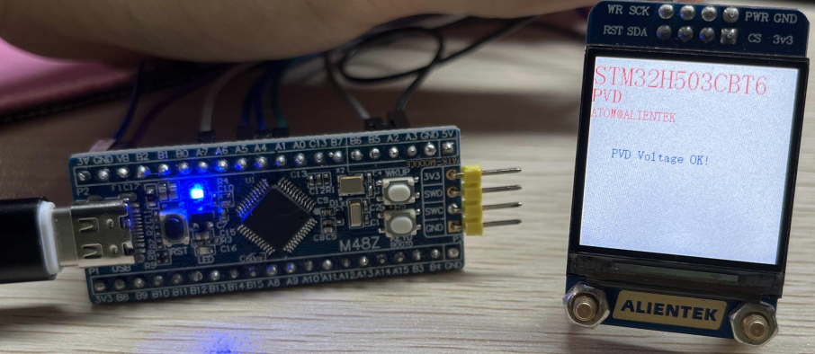

## PVD voltage monitoring example<a name="brief"></a>

### 1 Brief
The function of this program is when the MCU power supply Voltage is lower than 2.7V, the serial port print **PVD Low Voltage!**, when the supply Voltage returns to higher than 2.7V, the serial port prints **PVD Voltage OK!**. You can also see the tips on the 1.3 inch screen, and see the details of the connection method in ``10_TFTLCD_MCU``.
### 2 Hardware Hookup
The hardware resources used in this experiment are:
+ LED - PA8
+ USART1 - PA9\PA10
+ PVD
+ ALIENTEK 1.3-inch TFTLCD module(MCU screen only, SPI interface driver)

The PVD used in this experiment is an on-chip resource of STM32H503, so there is no corresponding connection schematic.

### 3 STM32CubeIDE Configuration


Let's copy the project from  **10_TFTLCD_MCU** and name both the project and the.ioc file **13_1_LowPower_PVD**. The **.ioc** file does not need to be modified for this experiment. But we will add the PWR-driver file ``pwr.c/pwr.h``.

##### code
###### pwr.c
The code for this file is as follows.
```c#
void pwr_pvd_init(uint32_t pls)
{
    PWR_PVDTypeDef pwr_pvd = {0};

    pwr_pvd.PVDLevel = pls;                          /* Detecting voltage level */
    pwr_pvd.Mode = PWR_PVD_MODE_IT_RISING_FALLING;   /* A double edge trigger using the rising
                                                      * and falling edge of the interrupt line is used */
    HAL_PWR_ConfigPVD(&pwr_pvd);

    HAL_NVIC_SetPriority(PVD_AVD_IRQn, 3 ,3);
    HAL_NVIC_EnableIRQ(PVD_AVD_IRQn);
    HAL_PWR_EnablePVD();                             /* Enable PVD detection */
}

/**
 * @brief    PVD interrupt service function
 * @param    None
 * @retval   None
 */
void PVD_IRQHandler(void)
{
    HAL_PWR_PVD_IRQHandler();
}

/**
 * @brief    PVD interrupt service callback function
 * @param    None
 * @retval   None
 */
void HAL_PWR_PVDCallback(void)
{
    if (__HAL_PWR_GET_FLAG(PWR_FLAG_PVDO)) /* The voltage is lower than the one selected by PLS */
    {
        lcd_show_string(30, 130, 200, 16, 16, "PVD Low Voltage!", RED); /* LCD display voltage is low */
        printf("PVD Low Voltage!\r\n");
    }
    else
    {
    	printf("PVD Voltage OK!\r\n");
        lcd_show_string(30, 130, 200, 16, 16, "PVD Voltage OK! ", BLUE); /* The LCD display voltage is normal */
    }
}
```
The first is the PVD initialization function, which config the voltage threshold of the PVD according to the passed parameter values, and turns on the relevant interrupt of the PVD and the enable PVD module.

After that is the interrupt callback function of PVD. When the power supply voltage monitored by PVD is less than the set voltage threshold, a prompt message will be displayed on the LCD and serial port. When the normal voltage is restored, the corresponding prompt information will also be provided.PVD will take corresponding operation when it detects that the supply voltage is below the set voltage threshold, but some operations may not be observed because the voltage is too low.

###### main.c
In the while loop of main, only the delayed function is called, as follows:
```c#
int main(void)
{
  /* USER CODE BEGIN 1 */
  uint8_t t = 0;
  /* USER CODE END 1 */

  /* MCU Configuration--------------------------------------------------------*/

  /* Reset of all peripherals, Initializes the Flash interface and the Systick. */
  HAL_Init();

  /* USER CODE BEGIN Init */

  /* USER CODE END Init */

  /* Configure the system clock */
  SystemClock_Config();

  /* USER CODE BEGIN SysInit */

  /* USER CODE END SysInit */

  /* Initialize all configured peripherals */
  MX_GPIO_Init();
  MX_ICACHE_Init();
  MX_SPI1_Init();
  MX_USART1_UART_Init();
  /* USER CODE BEGIN 2 */
  stm32h503cb_show_mesg();
  lcd_init();
  lcd_show_string(0, 5, 240, 32, 32, "STM32H503CBT6", RED);
  lcd_show_string(0, 34, 240, 24, 24, "PVD", RED);
  lcd_show_string(0, 60, 240, 16, 16, "ATOM@ALIENTEK", RED);
  /* The default LCD display voltage is normal */
  lcd_show_string(30, 110, 200, 16, 16, "PVD Voltage OK! ", BLUE);
  /* USER CODE END 2 */

  /* Infinite loop */
  /* USER CODE BEGIN WHILE */
  while (1)
  {
    if ((t % 20) == 0)
    {
       LED_TOGGLE();   /* LED state is flipped */
    }

    t++;
    HAL_Delay(500);

    /* USER CODE END WHILE */

    /* USER CODE BEGIN 3 */
  }
  /* USER CODE END 3 */
}
```
The driving LED blinks in the while loop to indicate that the experiment is running.


### 4 Running
#### 4.1 Compile & Download
After the compilation is complete, connect the DAP and the Mini Board, and then connect to the computer together to download the program to the Mini Board.
#### 4.2 Phenomenon
Press the reset button to restart the Mini Board, observe the LED flashing on the Mini Board, open the serial port and the host computer ATK-XCOM can see the prompt information of the experiment, indicating that the code download is successful.

If the system supply Voltage is lower than 2.7V, the LCD will display ``PVD Low Voltage!`` (The voltage is too low to see some of the phenomenon). If the system power supply is normal, the LCD will display ``PVD Voltage OK!``, as shown below:



[jump to title](#brief)