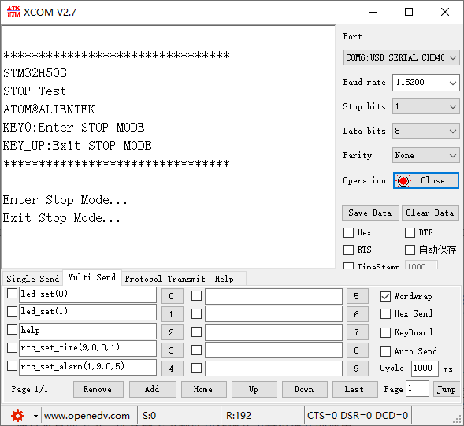
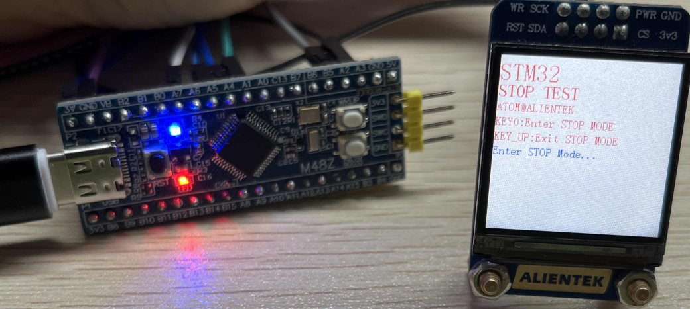

## LowPower_Stop example<a name="brief"></a>

### 1 Brief
The function of this program is when the KEY0 is pressed, Enter the Stop Mode, the serial port print **Enter Stop Mode...**. When WKUP is pressed, Exit Stop Mode is exited, and the serial port prints **EXIT Stop Mode...**. You can also see the tips on the 1.3 inch screen, and see the details of the connection method in ``10_TFTLCD_MCU``.
### 2 Hardware Description
The hardware resources used in this experiment are:
+ LED - PA8
+ USART1 - PA9\PA10
+ KEY - WKUP(PA0)
+ KEY - KEY0(PC13) 
+ ALIENTEK 1.3-inch TFTLCD module(MCU screen only, SPI interface driver)

This experiment introduces the stop mode in the low power mode and does not involve the connection schematic.

### 3 STM32CubeIDE Configuration


We copy the **13_2_LowPower_Sleep** project and name both the project and the.ioc file **13_3_LowPower_Stop**. 
This experiment is replicated from the previous section, so external interrupt configuration these are already configured. No additional changes to the.ioc file are required. It is only necessary to add the PWR driver file ``pwr.c/pwr.h``. The pwr file for this experiment is different from the one in the previous chapter.

##### code
###### pwr.c
The code for this file is as follows.
```c#
void pwr_enter_stop(void)
{
  HAL_PWR_ConfigAttributes(PWR_ALL, PWR_PRIV);
  HAL_SuspendTick();  /* Pause the tick clock to prevent wakeup from being interrupted by the tick clock */
  HAL_PWR_EnterSTOPMode(PWR_LOWPOWERREGULATOR_ON, PWR_STOPENTRY_WFI); /* Execute the WFI command and enter the stop mode */
}

/**
 * @brief    External interrupt callback function
 * @param    GPIO Pin : Interrupt pin
 * @note     This function is called by PWR WKUP INT IRQHandler()
 * @retval   None
 */
void HAL_GPIO_EXTI_Callback(uint16_t GPIO_Pin)
{
  if (GPIO_Pin == WK_UP_Pin)
  {
    /* The HAL_GPIO_EXTI_IRQHandler() function has cleared the interrupt flag for us,
     *  so we can call the callback without doing anything */
  }
}
```
The ``HAL_PWR_EnterSTOPMode`` function is called directly inside ``pwr_enter_stop`` to enter stop mode and wait for WKUP to interrupt wakeup.

In the stop mode, the system clock is provided by the HSI RC oscillator, and if we do not actively configure the system clock, the peripheral processing rate will be greatly reduced.

###### main.c
Here's the main function.
```c#
int main(void)
{
  /* USER CODE BEGIN 1 */
  uint8_t t = 0;
  uint8_t key = 0;
  /* USER CODE END 1 */

  /* MCU Configuration--------------------------------------------------------*/

  /* Reset of all peripherals, Initializes the Flash interface and the Systick. */
  HAL_Init();

  /* USER CODE BEGIN Init */

  /* USER CODE END Init */

  /* Configure the system clock */
  SystemClock_Config();

  /* USER CODE BEGIN SysInit */

  /* USER CODE END SysInit */

  /* Initialize all configured peripherals */
  MX_GPIO_Init();
  MX_ICACHE_Init();
  MX_USART1_UART_Init();
  MX_SPI1_Init();
  /* USER CODE BEGIN 2 */
  stm32h503cb_show_mesg();
  lcd_init();
  lcd_show_string(0, 5, 200, 32, 32,  "STM32", RED);
  lcd_show_string(0, 34, 200, 24, 24,  "STOP TEST", RED);
  lcd_show_string(0, 60, 200, 16, 16,  "ATOM@ALIENTEK", RED);
  lcd_show_string(0, 80, 200, 16, 16, "KEY0:Enter STOP MODE", RED);
  lcd_show_string(0, 100, 200, 16, 16, "KEY_UP:Exit STOP MODE", RED);
  /* USER CODE END 2 */

  /* Infinite loop */
  /* USER CODE BEGIN WHILE */
  while (1)
  {
    key = key_scan(0);

    if (key == KEY0_PRES)
    {
      lcd_show_string(0, 120, 200, 16, 16, "Enter STOP Mode...", BLUE);
      printf("Enter Stop Mode...\r\n");
      pwr_enter_stop();    /* Enter stop mode */
      lcd_show_string(0, 120, 200, 16, 16, "Exit  STOP Mode...", BLUE);
      printf("Exit Stop Mode...\r\n");
    }

    if ((t % 20) == 0)
    {
      LED_TOGGLE();        /* Every 200ms, the LED is flipped */
    }

    HAL_Delay(10);
    t++;
    /* USER CODE END WHILE */

    /* USER CODE BEGIN 3 */
  }
  /* USER CODE END 3 */
}
```
The function of this part is to press KEY0 to enter the stop mode. Then it waits for the external interrupt to wake up. When the WKUP key is pressed, the external interrupt is triggered, the stop mode is woken up, and the subsequent program is continued.


### 4 Running
#### 4.1 Compile & Download
After the compilation is complete, connect the DAP and the Mini Board, and then connect to the computer together to download the program to the Mini Board.
#### 4.2 Phenomenon
Press the reset button to restart the Mini Board, observe the LED flashing on the Mini Board, open the serial port and the host computer ATK-XCOM can see the prompt information of the experiment, indicating that the code download is successful. If the LED stops flashing when the KEY0 button is pressed, the serial port will display **Enter Stop Mode...**. If you press the WKUP button, the LED will resume flashing, and the serial port will display **Exit Stop Mode...**, there will also be a corresponding prompt message on the LCD screen as shown below.





[jump to title](#brief)