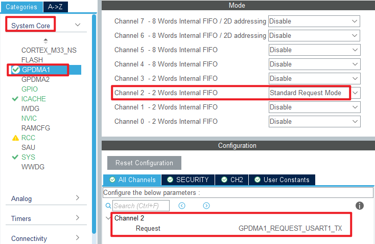
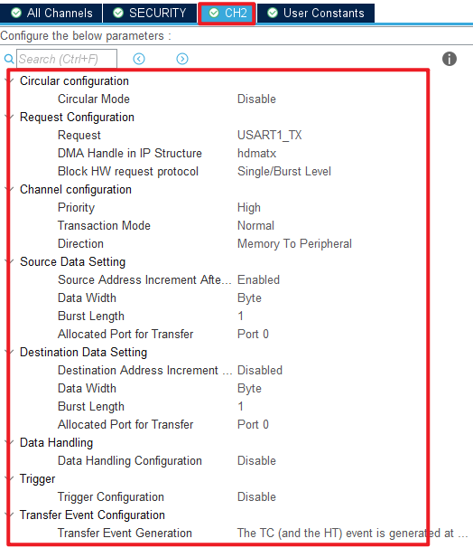
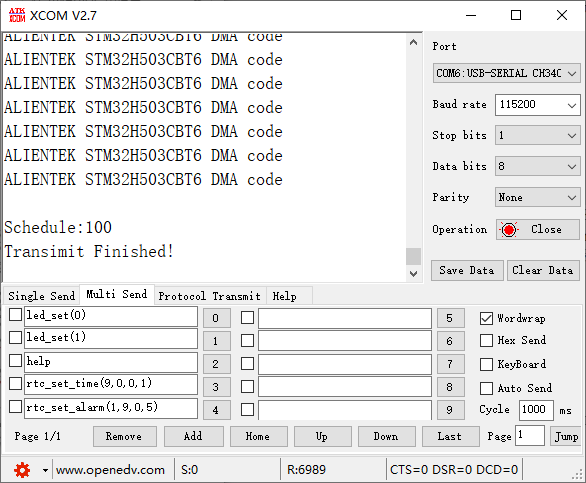

## DMA example<a name="brief"></a>

### 1 Brief
The function of this code is to press the KEY0 button, serial port USART1 to send data in DMA mode.
### 2 Hardware Hookup
The hardware resources used in this experiment are:
+ LED - PA8
+ USART1 - PA9\PA10
+ KEY - KEY0(PC13) 
+ GPDMA1 - Channel2 : USART1

The DMA used in this experiment is an on-chip resource of STM32H503, so there is no corresponding connection schematic.

### 3 STM32CubeIDE Configuration


We copy the **02_KEY** project and name both the project and the.ioc file **14_DMA**.Next we start the GPDMA configuration by double-clicking the **14_DMA.ioc** file.

Open **System Core > GPDMA** as shown below.





Click **File > Save**, and you will be asked to generate code.Click **Yes**.

##### code
###### main.c
In the main function, we have added some additional code, which is as follows.
```c#
/* USER CODE BEGIN PTD */
const uint8_t g_text_to_send[] = {"ALIENTEK STM32H503CBT6 DMA code\r\n"};  /* The string to send in a loop */

#define SEND_BUF_SIZE (sizeof(g_text_to_send)  * 200)                      /* Length of data sent */

static uint8_t g_sendbuf[SEND_BUF_SIZE];
/* USER CODE END PTD */

int main(void)
{
  /* USER CODE BEGIN 1 */
  uint8_t  key = 0;
  uint16_t i, j;
  uint8_t len;
  uint16_t pro = 0;      /* Schedule */
  /* USER CODE END 1 */

  /* MCU Configuration--------------------------------------------------------*/

  /* Reset of all peripherals, Initializes the Flash interface and the Systick. */
  HAL_Init();

  /* USER CODE BEGIN Init */

  /* USER CODE END Init */

  /* Configure the system clock */
  SystemClock_Config();

  /* USER CODE BEGIN SysInit */

  /* USER CODE END SysInit */

  /* Initialize all configured peripherals */
  MX_GPIO_Init();
  MX_GPDMA1_Init();
  MX_ICACHE_Init();
  MX_USART1_UART_Init();
  /* USER CODE BEGIN 2 */
  stm32h503cb_show_mesg();
  len = sizeof(g_text_to_send);   /* Fill the send data buffer */

  for (j = 0; j < SEND_BUF_SIZE; j++)
  {
    g_sendbuf[j] = g_text_to_send[j % len];
  }

  j = 0;

  /* USER CODE END 2 */

  /* Infinite loop */
  /* USER CODE BEGIN WHILE */
  while (1)
  {
    key = key_scan(0);

    if (key == KEY0_PRES)
    {
        printf("Start Transimit....\r\n");
        printf( "\r\n");

        HAL_UART_Transmit_DMA(&huart1, (uint8_t *)g_sendbuf, SEND_BUF_SIZE);

        /* Wait for the DMA transfer to complete
         * In practice, you can perform additional tasks while waiting for the DMA transfer to complete.
         */
        while (1)
        {
            if (g_uart_tx_completed == 1)  /* Wait for the serial port to finish sending data */
            {
                g_uart_tx_completed = 0;   /* Clear the serial port to send data completion flag */
                break;
            }

            pro = __HAL_DMA_GET_COUNTER(&handle_GPDMA1_Channel2); /* Get how many pieces of data are left */
            pro = ((SEND_BUF_SIZE - pro) * 100) / SEND_BUF_SIZE;  /* Percentage gain */
            printf( "\r\n");
            printf("Schedule:%d\r\n", pro);
        }

        printf("Transimit Finished!\r\n");
    }

    i++;
    HAL_Delay(10);   	/* delay 10ms */

    if ((i % 20) == 0)
    {
        i = 0;
        LED_TOGGLE();
    }

    /* USER CODE END WHILE */

    /* USER CODE BEGIN 3 */
  }
  /* USER CODE END 3 */
}
```
The flow of the main function is as follows: initialize the value of **g_sendbuf**, then use KEY0 to enable DMA transmission over the serial port, and finally clear the appropriate flag to indicate that the transfer has been completed.


### 4 Running
#### 4.1 Compile & Download
After the compilation is complete, connect the DAP and the Mini Board, and then connect to the computer together to download the program to the Mini Board.
#### 4.2 Phenomenon
Press the reset button to restart the Mini Board, observe the LED flashing on the Mini Board, open the serial port and the host computer **ATK-XCOM** can see the prompt information of the experiment, indicating that the code download is successful. After pressing the KEY0 button, you can see the data sent by the Mini Board in the serial port debugging assistant, and the transmission will be prompted after the completion of transmission, as shown in the following figure:



[jump to title](#brief)