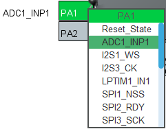
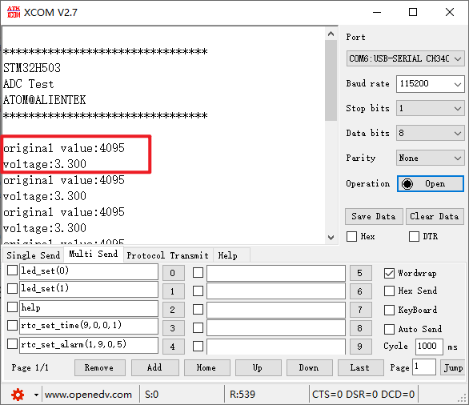

## ADC_Single_Channel example<a name="brief"></a>

### 1 Brief
The function of this code is that the ADC collects the voltage on channel 1, and displays the digital amount of the voltage converted by the ADC and the analog amount converted on the serial port debugging assistant.
### 2 Hardware Hookup
The hardware resources used in this experiment are:
+ LED - PA8
+ USART1 - PA9\PA10
+ ADC1 - Channel1(PA1)

The ADC used in this experiment is an on-chip resource of STM32H503, so there is no corresponding connection schematic.

### 3 STM32CubeIDE Configuration


We copy the **02_KEY** project and name both the project and the.ioc file **15_1_ADC_Single_Channel**.Next we start the ADC configuration by double-clicking the **15_1_ADC_Single_Channel.ioc** file.

In **Pinout&Configuration**, select PA1, set it as shown below.



Click **Analog > ADC1** to set mode.


Click **File > Save**, and you will be asked to generate code.Click **Yes**.

##### code
###### adc.c
We add some code to the adc.c file.First, we add code to the ADC1 initialization function ``MX_ADC1_Init``, as follows:
```c#
  /* USER CODE BEGIN ADC1_Init 2 */
  HAL_ADCEx_Calibration_Start(&hadc1, ADC_SINGLE_ENDED);   /* Calibration ADC */
  /* USER CODE END ADC1_Init 2 */
```
This line of code is added to the initialization function to calibrate the ADC.
Two separate functions have also been added, as follows.
```c#
uint32_t adc_get_result(void)
{
    HAL_ADC_Start(&hadc1);                      /* Turn on the ADC */
    HAL_ADC_PollForConversion(&hadc1, 10);      /* Round robin transformation */
    return (uint16_t)HAL_ADC_GetValue(&hadc1);  /* Returns the result of the last ADC1 rule group transformation */
}

/**
 * @brief   Takes the transformation value of the channel ch, takes it times, and averages it
 * @param   times : Get the number of times
 * @retval  channel ch the average of times conversion results
 */
uint32_t adc_get_result_average(uint8_t times)
{
    uint32_t temp_val = 0;
    uint8_t t;

    for (t = 0; t < times; t++)     /* Get The times data */
    {
        temp_val += adc_get_result();
        HAL_Delay(5);               /* delay 5ms */
    }

    return temp_val / times;        /* Returning the average */
}
```
The first function, ``adc_get_result``, gets the ADC conversion result by first calling ``HAL_ADC_Start`` and then ``HAL_ADC_PollForConversion``. Finally, the ``HAL_ADC_GetValue`` function is called to get the result of the conversion.

The second function, ``adc_get_result_average``, is used to get the average of the results of multiple ADC conversions to improve accuracy.

###### main.c
In the while loop of the main function, we call the function that converts the result of the ADC as follows:
```c#
int main(void)
{
  /* USER CODE BEGIN 1 */
  uint16_t adcdata;
  uint16_t voltage;
  /* USER CODE END 1 */

  /* MCU Configuration--------------------------------------------------------*/

  /* Reset of all peripherals, Initializes the Flash interface and the Systick. */
  HAL_Init();

  /* USER CODE BEGIN Init */

  /* USER CODE END Init */

  /* Configure the system clock */
  SystemClock_Config();

  /* USER CODE BEGIN SysInit */

  /* USER CODE END SysInit */

  /* Initialize all configured peripherals */
  MX_GPIO_Init();
  MX_ICACHE_Init();
  MX_USART1_UART_Init();
  MX_ADC1_Init();
  /* USER CODE BEGIN 2 */
  stm32h503cb_show_mesg();
  /* USER CODE END 2 */

  /* Infinite loop */
  /* USER CODE BEGIN WHILE */
  while (1)
  {
    adcdata = adc_get_result_average(10);     /* The result of ADC channel 1 conversion and mean filtering is obtained */
    printf("original value:%d\r\n", adcdata);

    voltage = (adcdata * 3300) / 4095;        /* Calculate the actual voltage value (1000 times larger) */
    printf("voltage:%d.%d\r\n", voltage / 1000, voltage % 1000);

    LED_TOGGLE();
    HAL_Delay(500);   /* delay 500ms */

    /* USER CODE END WHILE */

    /* USER CODE BEGIN 3 */
  }
  /* USER CODE END 3 */
}
```
The conversion results of ADC channel 1 are continuously obtained in the while loop, and these results are mean-filtered. Then the processed value is sent to the host computer of the serial port. At the same time, the analog value of the voltage is calculated and displayed in the host computer of the serial port.


### 4 Running
#### 4.1 Compile & Download
After the compilation is complete, connect the DAP and the Mini Board, and then connect to the computer together to download the program to the Mini Board.
#### 4.2 Phenomenon
Press the reset button to restart the Mini Board, observe the LED flashing on the Mini Board, open the serial port and the host computer **ATK-XCOM** can see the prompt information of the experiment, indicating that the code download is successful. When a dupont wire is used to connect the PA1 pin with different voltage values, the digital and analog voltage of the serial port host computer will also change. **It should be noted that the input voltage cannot exceed the 3.3V threshold of the Mini Board**, otherwise it may damage the Mini Board. The phenomenon is illustrated in the following figure.



[jump to title](#brief)