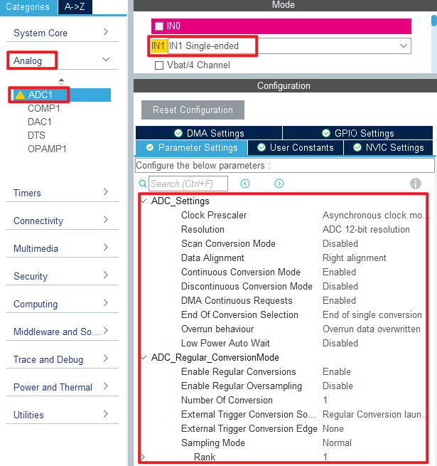
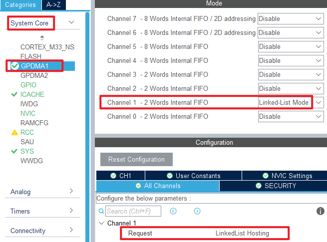
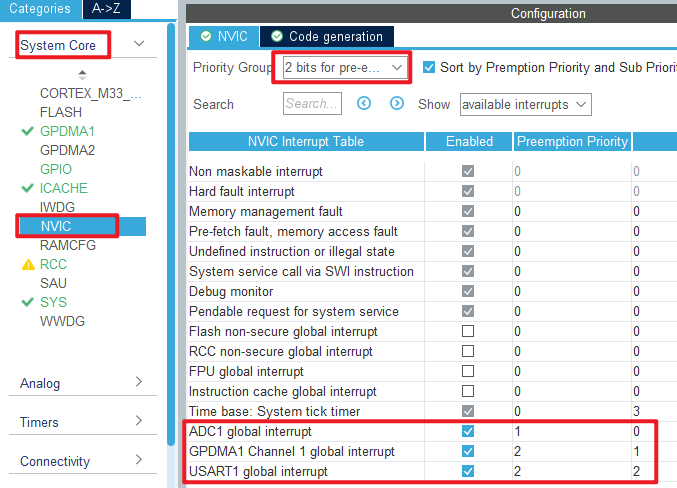
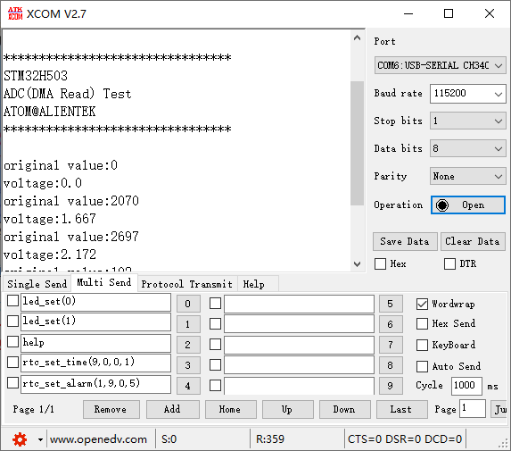

## ADC_DMA_Single_Channel example<a name="brief"></a>

### 1 Brief
The function of this code is to collect the voltage on the ADC channel 1 through DMA, and display the digital amount of the voltage converted by the ADC and the analog amount converted on the serial port debugging assistant.
### 2 Hardware Hookup
The hardware resources used in this experiment are:
+ LED - PA8
+ USART1 - PA9\PA10
+ ADC1 - Channel1(PA1)

The ADC used in this experiment is an on-chip resource of STM32H503, so there is no corresponding connection schematic.

### 3 STM32CubeIDE Configuration


We copy the previous chapter project and name both the project and the.ioc file **15_2_ADC_DMA_Single_Channel**.Next we start the ADC configuration by double-clicking the **15_2_ADC_DMA_Single_Channel.ioc** file.

Since our implementation is based on the previous project, the ADC pin does not need to be configured again, and we mainly modify the ADC parameters and configure the DMA.

Click **Analog > ADC1** to set.



In this experiment, DMA is used to transfer data, and the configuration is shown in the following figure.



Then configure the interrupt priority for DMA.



Click **File > Save**, and you will be asked to generate code.Click **Yes**.

##### code
We add some code to the adc.c file.First, we add code to the ADC1 initialization function ``MX_ADC1_Init``, as follows.
###### adc.c
```c#
  /* USER CODE BEGIN ADC1_Init 2 */
  HAL_ADCEx_Calibration_Start(&hadc1, ADC_SINGLE_ENDED);   /* Calibration ADC */
  /* USER CODE END ADC1_Init 2 */
```
This line of code is added to the initialization function to calibrate the ADC.

A separate function is also added as follows.
```c#
void HAL_ADC_ConvCpltCallback(ADC_HandleTypeDef *hadc)
{
    g_adc_dma_sta = 1;
}
```
The above code is used to DMA transfer completion callback function.

###### gpdma.c
In the DMA initialization function, the following code is added.
```c#
  /* USER CODE BEGIN GPDMA1_Init 2 */
  /* ADC1 DMA initialization */
  node_conf.NodeType = DMA_GPDMA_LINEAR_NODE;                                              /* GPDMA linear addressable node type */
  node_conf.Init.Request = GPDMA1_REQUEST_ADC1;                                            /* DMA channel request */
  node_conf.Init.BlkHWRequest = DMA_BREQ_SINGLE_BURST;                                     /* Single/burst level hardware request protocol */
  node_conf.Init.Direction = DMA_PERIPH_TO_MEMORY;                                         /* DMA channel transfer direction: peripheral to memory */
  node_conf.Init.SrcInc = DMA_SINC_FIXED;                                                  /* Source incremental mode: fixed mode single/burst */
  node_conf.Init.DestInc = DMA_DINC_INCREMENTED;                                           /* Target incremental pattern: Incremental pattern single/burst */
  node_conf.Init.SrcDataWidth = DMA_SRC_DATAWIDTH_HALFWORD;                                /* Width of source data: 16 bits */
  node_conf.Init.DestDataWidth = DMA_DEST_DATAWIDTH_HALFWORD;                              /* Target data width: 16 bits */
  node_conf.Init.SrcBurstLength = 1;                                                       /* Specifies the source burst length of the DMA, ranging from 1 to 64 */
  node_conf.Init.DestBurstLength = 1;                                                      /* Specified target burst length, range: 1 to 64 */
  node_conf.Init.TransferAllocatedPort = DMA_SRC_ALLOCATED_PORT1|DMA_DEST_ALLOCATED_PORT1; /* Specifies the port to which the transmission is assigned */
  node_conf.Init.TransferEventMode = DMA_TCEM_BLOCK_TRANSFER;                              /* Specifies the transfer event mode for the DMA channel */
  node_conf.Init.Mode = DMA_NORMAL;                                                        /* DMA mode: normal mode transmission */
  node_conf.TriggerConfig.TriggerPolarity = DMA_TRIG_POLARITY_MASKED;                      /* Set the DMA channel trigger polarity */
  node_conf.DataHandlingConfig.DataExchange = DMA_EXCHANGE_NONE;                           /* DMA channel data exchange mode: no data exchange */
  node_conf.DataHandlingConfig.DataAlignment = DMA_DATA_RIGHTALIGN_ZEROPADDED;             /* If the source data width < target data width => is right-aligned, fill 0 to the target data width */

  HAL_DMAEx_List_BuildNode(&node_conf, &gpdma1_ch1_node);
  HAL_DMAEx_List_InsertNode(&gpdma1_ch1_qlist, NULL, &gpdma1_ch1_node);                    /* Inserting new nodes */
  HAL_DMAEx_List_SetCircularMode(&gpdma1_ch1_qlist);                                       /* Sets the circular mode of the list queue */
  HAL_DMAEx_List_LinkQ(&handle_GPDMA1_Channel1, &gpdma1_ch1_qlist);                        /* Linked list queues to DMA channels */
  __HAL_LINKDMA(&hadc1, DMA_Handle, handle_GPDMA1_Channel1);                               /* Associate the DMA handle with the ADC handle */
  /* USER CODE END GPDMA1_Init 2 */
```
The above code is included to link the DMA handle with the ADC handle.

###### main.c
Here's the code in the main function.
```c#
int main(void)
{
  /* USER CODE BEGIN 1 */
  uint16_t i;
  uint32_t sum;
  uint16_t adcdata;
  uint16_t voltage;
  /* USER CODE END 1 */

  /* MCU Configuration--------------------------------------------------------*/

  /* Reset of all peripherals, Initializes the Flash interface and the Systick. */
  HAL_Init();

  /* USER CODE BEGIN Init */

  /* USER CODE END Init */

  /* Configure the system clock */
  SystemClock_Config();

  /* USER CODE BEGIN SysInit */

  /* USER CODE END SysInit */

  /* Initialize all configured peripherals */
  MX_GPIO_Init();
  MX_GPDMA1_Init();
  MX_ICACHE_Init();
  MX_ADC1_Init();
  MX_USART1_UART_Init();
  /* USER CODE BEGIN 2 */
  stm32h503cb_show_mesg();
  HAL_ADCEx_Calibration_Start(&hadc1, ADC_SINGLE_ENDED);
  HAL_ADC_Start_DMA(&hadc1, (uint32_t *)g_adc_dma_buf, ADC_DMA_BUF_SIZE);
  /* USER CODE END 2 */

  /* Infinite loop */
  /* USER CODE BEGIN WHILE */
  while (1)
  {
    HAL_ADC_Start(&hadc1);

    if (g_adc_dma_sta == 1)
    {
        /* The average value of the ADC data acquired by DMA is calculated */
        sum = 0;

        for (i = 0; i < ADC_DMA_BUF_SIZE; i++)/* accumulation */
        {
           sum += g_adc_dma_buf[i];
        }

        adcdata = sum / ADC_DMA_BUF_SIZE;     /* averaging */

        /* displaying results */
        printf("original value:%d\r\n", adcdata);

        voltage = (adcdata * 3300) / 4096;    /* Gets the calculated actual voltage value with a decimal, such as 3.1111 */
        printf("voltage:%d.%d\r\n", voltage / 1000, voltage % 1000);

        g_adc_dma_sta = 0;                    /* Clear the DMA acquisition completion status flag */
    }

    LED_TOGGLE();
    HAL_Delay(500);   /* delay 500ms */

    /* USER CODE END WHILE */

    /* USER CODE BEGIN 3 */
  }
  /* USER CODE END 3 */
}
```
This section of code is very similar to the ADC acquisition experiment in the previous chapter, except that DMA transfer is enabled. DMA transfers are stored in the **g_adc_dma_buf** array, which is averaged to reduce error.


### 4 Running
#### 4.1 Compile & Download
After the compilation is complete, connect the DAP and the Mini Board, and then connect to the computer together to download the program to the Mini Board.
#### 4.2 Phenomenon
Press the reset button to restart the Mini Board, observe the LED flashing on the Mini Board, open the serial port and the host computer **ATK-XCOM** can see the prompt information of the experiment, indicating that the code download is successful. When a dupont wire is used to connect the PA1 pin with different voltage values, the digital and analog voltage of the serial port host computer will also change. **It should be noted that the input voltage cannot exceed the 3.3V threshold of the Mini Board**, otherwise it may damage the Mini Board. The phenomenon is illustrated in the following figure:



[jump to title](#brief)