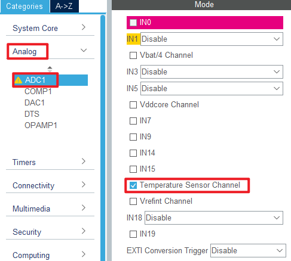
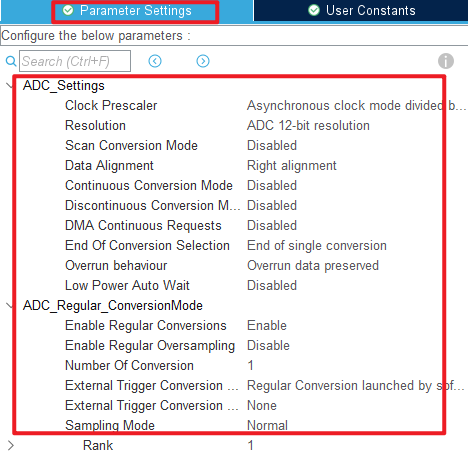
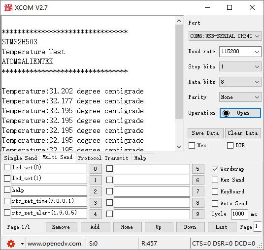

## ADC_Temperature example<a name="brief"></a>


### 1 Brief
The function of this program is that ADC collects the voltage on channel 16, converts the voltage value into the temperature value through the algorithm, and displays the converted temperature value on the host computer of the serial port.
### 2 Hardware Hookup
The hardware resources used in this experiment are:
+ LED - PA8
+ USART1 - PA9\PA10
+ ADC1 - Channel16

The ADC used in this experiment is an on-chip resource of STM32H503, so there is no corresponding connection schematic.

### 3 STM32CubeIDE Configuration


We copy the **04_UART** project and name both the project and the.ioc file **16_ADC_Temperature**.Next we start the ADC configuration by double-clicking the **16_ADC_Temperature.ioc** file.

The ADC channel 16 used in this experiment is set as shown below.





Click **File > Save**, and you will be asked to generate code.Click **Yes**.

##### code
We add some code to adc.c, starting with ADC1's initialization function ``MX_ADC1_Init``, as follows.
###### adc.c
```c#
  /* USER CODE BEGIN ADC1_Init 2 */
  HAL_ADCEx_Calibration_Start(&hadc1, ADC_SINGLE_ENDED);   /* Calibration ADC */
  /* USER CODE END ADC1_Init 2 */
```
This line of code is added to the initialization function to calibrate the ADC.
We also added three separate functions as follows.
```c#
uint32_t adc_get_result(void)
{
    HAL_ADC_Start(&hadc1);                            /* Turn on the ADC */
    HAL_ADC_PollForConversion(&hadc1, 10);            /* Round robin transformation */
    return (uint16_t)HAL_ADC_GetValue(&hadc1);        /* Returns the result of the last ADC1 rule group transformation */
}

/**
 * @brief   Takes the transformation value of the channel ch, takes it times, and averages it
 * @param   times : Get the number of times
 * @retval  channel ch the average of times conversion results
 */
uint32_t adc_get_result_average(uint8_t times)
{
    uint32_t temp_val = 0;
    uint8_t t;

    for (t = 0; t < times; t++)     /* Get The times data */
    {
        temp_val += adc_get_result();
        HAL_Delay(5);               /* delay 5ms */
    }

    return temp_val / times;        /* Returning the average */
}

/**
 * @brief  Gets the internal temperature sensor temperature value
 * @param  none
 * @retval The temperature (expanded by 100 times in degrees Celsius).
 */
short adc_get_temperature(void)
{
    uint32_t adcx;
    short result;
    double temperature;

    adcx = adc_get_result_average(20);  /* The internal temperature sensor channel was read and 20 times were averaged */
    temperature = (float)adcx * (3.3 / 4096);               /* Convert to voltage values */
    temperature = (1.43 - temperature) / 0.0043 + 25;       /* calculating temperature */
    result = temperature *= 100;                            /* 100 times bigger. */
    return result;
}
```
After obtaining the output voltage of the temperature sensor, the above code converts the voltage value to the actual temperature value through the temperature conversion formula.

###### main.c
Here's the main function.
```c#
int main(void)
{
  /* USER CODE BEGIN 1 */
  int16_t temperature;
  /* USER CODE END 1 */

  /* MCU Configuration--------------------------------------------------------*/

  /* Reset of all peripherals, Initializes the Flash interface and the Systick. */
  HAL_Init();

  /* USER CODE BEGIN Init */

  /* USER CODE END Init */

  /* Configure the system clock */
  SystemClock_Config();

  /* USER CODE BEGIN SysInit */

  /* USER CODE END SysInit */

  /* Initialize all configured peripherals */
  MX_GPIO_Init();
  MX_ICACHE_Init();
  MX_USART1_UART_Init();
  MX_ADC1_Init();
  /* USER CODE BEGIN 2 */
  stm32h503cb_show_mesg();
  /* USER CODE END 2 */

  /* Infinite loop */
  /* USER CODE BEGIN WHILE */
  while (1)
  {
    temperature = adc_get_temperature();  /* Get the internal temperature sensor temperature value */

    if (temperature < 0)                  /* If the temperature is negative, a negative sign is displayed */
    {
        temperature = -temperature;
    }

    printf("Temperature:%d.%d degree centigrade\r\n", temperature / 1000, temperature % 1000);

    LED_TOGGLE();
    HAL_Delay(500);   /* delay 500ms */

    /* USER CODE END WHILE */

    /* USER CODE BEGIN 3 */
  }
  /* USER CODE END 3 */
}
```
This code is relatively simple, constantly calling the ``adc_get_temperature`` function to obtain the temperature value collected by the internal temperature sensor, and the temperature value is displayed in real time through the serial port host computer.


### 4 Running
#### 4.1 Compile & Download
After the compilation is complete, connect the DAP and the Mini Board, and then connect to the computer together to download the program to the Mini Board.
#### 4.2 Phenomenon
Press the reset button to restart the Mini Board, observe the LED flashing on the Mini Board, open the serial port and the host computer **ATK-XCOM** can see the prompt information of the experiment, indicating that the code download is successful. The temperature value of the internal temperature sensor on the Mini Board will be displayed on the host computer of the serial port, as shown in the following figure.



[jump to title](#brief)