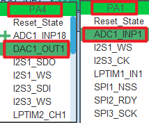
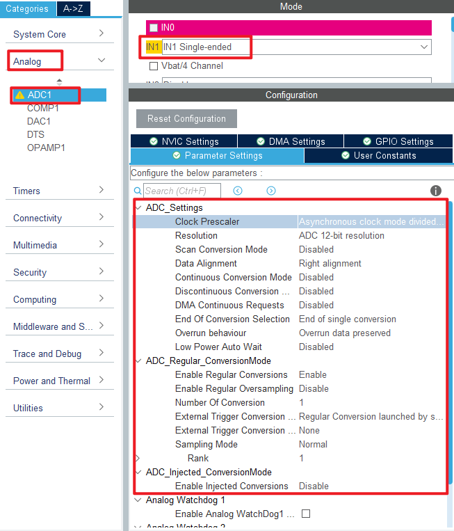
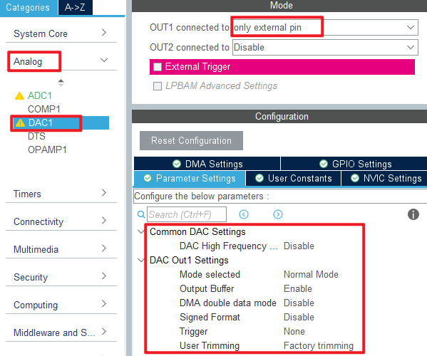
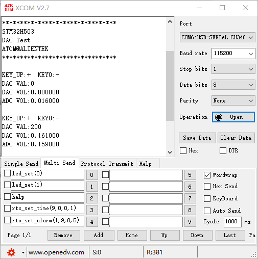

## DAC_Output example<a name="brief"></a>

### 1 Brief
The function of this code is the serial port host computer constantly refresh display PA4 pin output voltage of the digital amount, analog amount and PA1 pin input voltage analog amount. Press the WKUP button to increase the voltage output of the PA4 pin, and press the KEY0 button to reduce the voltage output of the PA4 pin.
### 2 Hardware Hookup
The hardware resources used in this experiment are:
+ LED - PA8
+ USART1 - PA9\PA10
+ ADC1 - Channel1(PA1)
+ DAC1 - Channel1(PA4)

The DAC used in this experiment is an on-chip resource of STM32H503, so there is no corresponding connection schematic.

### 3 STM32CubeIDE Configuration


We copy the **04_UART** project and name both the project and the.ioc file **17_1_DAC_Output**.Next we start the DAC configuration by double-clicking the **17_1_DAC_Output.ioc** file.

In **Pinout&Configuration**, click **PA1** and **PA4** pin to set mode.



Configure the following figure in **Analog->ADC1**.



Then open **Analog->DAC1** to configure.



Click **File > Save**, and you will be asked to generate code.Click **Yes**.
The code for the ADC part was described in section ``15_1_ADC_Single_Channel``, but the DAC part is introduced here.

##### code
We add some code to adc.c, starting with DAC1's initialization function ``MX_DAC1_Init``, as follows.
###### dac.c
```c#
  /* USER CODE BEGIN DAC1_Init 2 */
  HAL_DAC_Start(&hdac1, DAC_CHANNEL_1);  /* Open DAC channel 1 */
  /* USER CODE END DAC1_Init 2 */
```
This line is added to the initialization function to open DAC channel 1.
A separate function has also been added as follows.
```c#
/**
 * @brief   Sets channel 1/2 output voltage
 * @param   vol  : 0-3300, representing 0-3.3V
 * @retval  None
 */
void dac_set_voltage(uint16_t vol)
{
    double temp = vol;
    temp /= 1000;
    temp = temp * 4096 / 3.3;

    if (temp >= 4096)
    {
        temp = 4095;   /* If the value is greater than or equal to 4096, then 4095 is taken */
    }

    HAL_DAC_SetValue(&hdac1, DAC_CHANNEL_1, DAC_ALIGN_12B_R, temp); /* The 12-bit right-aligned data format sets the DAC value */
}
```
This function converts voltage values to DAC input values and is set from 0 to 3300, representing **0 to 3.3V**.

###### main.c
Here's the main function.
```c#
int main(void)
{
  /* USER CODE BEGIN 1 */
  uint8_t key;
  uint16_t dacdata = 0;
  uint8_t t = 0;
  uint16_t dacoutdata;
  float dac_voltage;
  uint16_t adcdata;
  float adc_voltage;
  /* USER CODE END 1 */

  /* MCU Configuration--------------------------------------------------------*/

  /* Reset of all peripherals, Initializes the Flash interface and the Systick. */
  HAL_Init();

  /* USER CODE BEGIN Init */

  /* USER CODE END Init */

  /* Configure the system clock */
  SystemClock_Config();

  /* USER CODE BEGIN SysInit */

  /* USER CODE END SysInit */

  /* Initialize all configured peripherals */
  MX_GPIO_Init();
  MX_DAC1_Init();
  MX_ICACHE_Init();
  MX_USART1_UART_Init();
  MX_ADC1_Init();

  /* USER CODE BEGIN 2 */
  stm32h503cb_show_mesg();
  HAL_DAC_SetValue(&hdac1, DAC_CHANNEL_1, DAC_ALIGN_12B_R, 0);  /* The initial value is 0 */
  /* USER CODE END 2 */

  /* Infinite loop */
  /* USER CODE BEGIN WHILE */
  while (1)
  {
    t++;
    key = key_scan(0);         /* Scan key */

    if (key == WKUP_PRES)      /* When the WK_UP button is pressed, the DAC output is increased by 200 */
    {
        if (dacdata < 4000)
        {
           dacdata += 200;
        }

        HAL_DAC_SetValue(&hdac1, DAC_CHANNEL_1, DAC_ALIGN_12B_R, dacdata); /* Setting the DAC value */
    }
    else if (key == KEY0_PRES) /* KEY0 key press reduces DAC output by 200 */
    {
        if (dacdata > 200)
        {
           dacdata -= 200;
        }
        else
        {
           dacdata = 0;
        }

        HAL_DAC_SetValue(&hdac1, DAC_CHANNEL_1, DAC_ALIGN_12B_R, dacdata); /* Setting the DAC value */
    }

    if ((t == 10) || (key == WKUP_PRES) || (key == KEY0_PRES))
    {
        printf("KEY_UP:+  KEY0:-\r\n");
        dacoutdata = HAL_DAC_GetValue(&hdac1, DAC_CHANNEL_1);  /* Get the digital quantity of the DAC output voltage */
        printf("DAC VAL:%d\r\n", dacoutdata);                  /* Display the digital amount of DAC output voltage */

        dac_voltage = (dacoutdata * 3300) / 4096;              /* Calculate the actual output voltage value (1000 times larger) */
        printf("DAC VOL:%f\r\n", dac_voltage / 1000);

        adcdata = adc_get_result_average(10);                  /* Get the digital amount of the voltage collected by the ADC */
        adc_voltage = (adcdata * 3300) / 4096;                 /* Calculate the actual voltage value (1000 times larger) */
        printf("ADC VOL:%f\r\n", adc_voltage / 1000);
        printf("\r\n");

        LED_TOGGLE();
        t = 0;
    }

    HAL_Delay(100);   /* delay 100ms */

    /* USER CODE END WHILE */

    /* USER CODE BEGIN 3 */
  }
  /* USER CODE END 3 */
}
```
In this part of the code, we control the voltage value of DAC output by WKUP and KEY0 keys, and display the results on the serial port host computer.


### 4 Running
#### 4.1 Compile & Download
After the compilation is complete, connect the DAP and the Mini Board, and then connect to the computer together to download the program to the Mini Board.
#### 4.2 Phenomenon
Press the reset button to restart the Mini Board, observe the LED flashing on the Mini Board, open the serial port and the host computer **ATK-XCOM** can see the prompt information of the experiment, indicating that the code download is successful. Connect **PA1** and **PA4** pins with a dupont line, and press the KEY0 or WKUP button to adjust the output voltage of DAC channel 1. You can see that the analog and digital amount of DAC output voltage displayed by the host computer of the serial port and the analog amount of voltage collected by the ADC also change. The phenomenon is illustrated in the following figure:



[jump to title](#brief)
