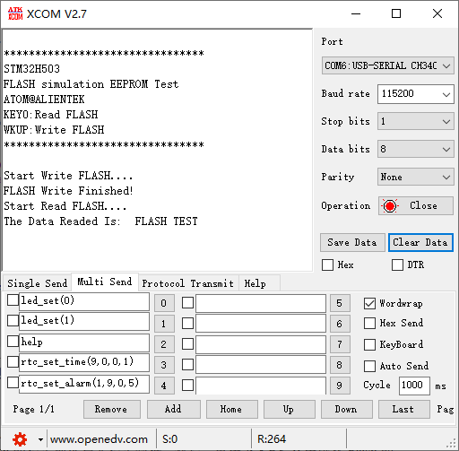

## FLASH_EEPROM example<a name="brief"></a>

### 1 Brief
The function of this program is to press the WKUP and KEY0 keys, respectively, the Flash data write and read operations, read the data will be displayed to the serial port host computer.
### 2 Hardware Hookup
The hardware resources used in this experiment are:
+ LED - PA8
+ USART1 - PA9\PA10
+ KEY - WKUP(PA0)
+ KEY - KEY0(PC13) 

The FLASH used in this experiment is an on-chip resource of STM32H503, so there is no corresponding connection schematic.

### 3 STM32CubeIDE Configuration

We copy the **11_USMART** project and name both the project and the.ioc file **18_FLASH_EEPROM**.
This experiment does not need to be configured on STM32CubeIDE, so after copying the project, you can directly add the user driver code.

##### code
###### stmflash.h
In Flash driver, Flash related definitions and Flash sector start address definitions.
```c#
/* FLASH start address */
#define STM32_FLASH_BASE        0x08000000                            /* STM32 FLASH start address */
#define STM32_FLASH_SIZE        0x20000                               /* Total STM32 FLASH size */
#define FLASH_WAITETIME         50000                                 /* Flash waits for a timeout */
```
**STM32_FLASH_BASE** is the start address of the FLASH.
**STM32_FLASH_SIZE** is the total FLASH size.
The above two macro definitions are fixed along with the chip.

##### stmflash.c
```c#
void stmflash_read(uint32_t raddr, uint32_t *pbuf, uint32_t length)
{
    uint32_t  i;

    for (i = 0; i < length; i++)
    {
        pbuf[i] = stmflash_read_word(raddr);/* Read 4 bytes */
        raddr += 4;                         /* Offset by 4 bytes */
    }
}
```
The above function is the FLASH driver in the read function, the function is mainly to read the value of the address, used to write function call check, to ensure that the success of the write.
```c#
void stmflash_write(uint32_t waddr, uint32_t *pbuf, uint32_t length)
{
    uint32_t addrx;
    uint32_t endaddr;
    uint32_t first_sector = 0;
    uint32_t num_sectors = 0;
    uint32_t bank_number = 0;
    uint32_t erase_addr;                                                /* Erase error; this value is the address of the sector where the error occurred */
    FLASH_EraseInitTypeDef flash_erase_init = {0};
    HAL_StatusTypeDef status = HAL_OK;

    if ((waddr < STM32_FLASH_BASE) ||                                   /* The specified address is smaller than the flash start address */
        (waddr > (STM32_FLASH_BASE + STM32_FLASH_SIZE)) ||              /* The specified address is greater than the final flash address */
         waddr % 4)                                                     /* The specified address is not aligned by 4 bytes */
    {
        return;                                                         /* illegal address */
    }

    HAL_ICACHE_Disable();                                               /* Disable instruction caching */
    HAL_FLASH_Unlock();                                                 /* FLASH unlock */

    addrx = waddr;                                                      /* The starting address to which data are written */
    endaddr = waddr + length * 4;                                       /* The end address at which data should be written */

    first_sector = stmflash_get_flash_sector(addrx);                    /* Gets the first sector to erase */
    num_sectors = stmflash_get_flash_sector(endaddr) - first_sector + 1;/* Gets the number of sectors to be erased */
    bank_number = stmflash_get_flash_bank(addrx);                       /* Get the bank for the given address */

    if (addrx < 0x081FFFFF)                                             /* Only the main storage area needs to be erased */
    {
        while (addrx < endaddr)                                         /* Clear all obstacles (for non-FFFFFFFF, erase first) */
        {
            if ((uint32_t)stmflash_read_word(addrx) != 0xFFFFFFFF)      /* There exists a non-0xFFFFFFFF */
            {
                flash_erase_init.TypeErase = FLASH_TYPEERASE_SECTORS;   /* In the form of sector erasure */
                flash_erase_init.Banks = bank_number;                   /* Erase the bank */
                flash_erase_init.Sector = first_sector;                 /* The first sector to erase */
                flash_erase_init.NbSectors = num_sectors;               /* The number of sectors to erase */
                status = HAL_FLASHEx_Erase( &flash_erase_init, &erase_addr);

                if (status == HAL_OK)                                   /* Erase successfully */
                {
                    break;
                }
            }
            else                                                        /* No need to erase */
            {
                addrx += 4;
            }
        }
    }

    if (status == HAL_OK)                                               /* There is no error in erasing a sector */
    {
        for(int i = 0; i < length; i++)
        {
            HAL_FLASH_Program(FLASH_TYPEPROGRAM_QUADWORD, waddr, (uint32_t)&pbuf[i]);
            waddr += 4;                                                 /* Point to the next half word */
        }
    }

    HAL_FLASH_Lock();                                                   /* Lock */
    HAL_ICACHE_Enable();                                                /* Enable instruction caching */
}
```
The preceding function writes data of a specified length at a specified address.
A few things to note:
+ The write address must be outside the user code area
+ The write address must be a multiple of 32
+ Single write length must be a multiple of 32 bytes (4 words)

This is due to the nature of the FLASH of STM32H5, where each write must be 128 bits wide, which is 16 bytes.

###### usmart_port.c
The **usmart_nametab** array is modified in this file to facilitate the call validation of the relevant functions as follows:
```c#
struct _m_usmart_nametab usmart_nametab[] =
{
#if USMART_USE_WRFUNS == 1      /* If read and write operations are enabled */
    {(void *)read_addr, "uint32_t read_addr(uint32_t addr)"},
    {(void *)write_addr, "void write_addr(uint32_t addr,uint32_t val)"},
#endif
    {(void *)stmflash_read_word, "uint32_t stmflash_read_word(uint32_t faddr)"},
    {(void *)stmflash_test_write, "void stmflash_test_write(uint32_t waddr, uint32_t wdata)"},
};
```
The related functions of stmflash are added to USMART, so that the value written or read by FLASH can be set directly through the serial port.
###### main.c
Here's the main function.
```c#
int main(void)
{
  /* USER CODE BEGIN 1 */
  uint8_t key = 0;
  uint16_t i = 0;
  uint8_t data[SIZE];
  /* USER CODE END 1 */

  /* MCU Configuration--------------------------------------------------------*/

  /* Reset of all peripherals, Initializes the Flash interface and the Systick. */
  HAL_Init();

  /* USER CODE BEGIN Init */

  /* USER CODE END Init */

  /* Configure the system clock */
  SystemClock_Config();

  /* USER CODE BEGIN SysInit */

  /* USER CODE END SysInit */

  /* Initialize all configured peripherals */
  MX_GPIO_Init();
  MX_ICACHE_Init();
  MX_USART1_UART_Init();
  MX_TIM2_Init();
  /* USER CODE BEGIN 2 */
  stm32h503cb_show_mesg();
  /* USER CODE END 2 */

  /* Infinite loop */
  /* USER CODE BEGIN WHILE */
  while (1)
  {
    key = key_scan(0);

    if (key == WKUP_PRES)                           /* WKUP PRES is pressed to write STM32 FLASH */
    {
        printf("Start Write FLASH....\r\n");
        stmflash_write(FLASH_SAVE_ADDR, (uint32_t *)g_text_buf, SIZE);
        printf("FLASH Write Finished!\r\n");        /* Prompt transmission completed */
    }

    if (key == KEY0_PRES)                           /* KEY0 is pressed to read the string and display it */
    {
        printf("Start Read FLASH.... \r\n");
        stmflash_read(FLASH_SAVE_ADDR, (uint32_t *)data, SIZE);
        printf("The Data Readed Is:  %s\r\n", data);/* Displays the string read */
    }

    i++;
    HAL_Delay(10);                                  /* delay 10ms */

    if (i == 20)
    {
        LED_TOGGLE();                               /* Prompt that the system is running */
        i = 0;
    }
    /* USER CODE END WHILE */

    /* USER CODE BEGIN 3 */
  }
  /* USER CODE END 3 */
}
```
When the key WKUP is detected to be pressed in the while loop, a piece of data is written to the FLASH space at the beginning of the specified address. When KEY0 is detected, the spatial data starting from the specified address of FLASH is read.


### 4 Running
#### 4.1 Compile & Download
After the compilation is complete, connect the DAP and the Mini Board, and then connect to the computer together to download the program to the Mini Board.
#### 4.2 Phenomenon
Press the reset button to restart the Mini Board, observe the LED flashing on the Mini Board, open the serial port and the host computer ATK-XCOM can see the prompt information of the experiment, indicating that the code download is successful. At this time, press the **WKUP** button, and then press the **KEY0** button, the serial port host will display the information written to FLASH, as shown in the following figure:



[jump to title](#brief)