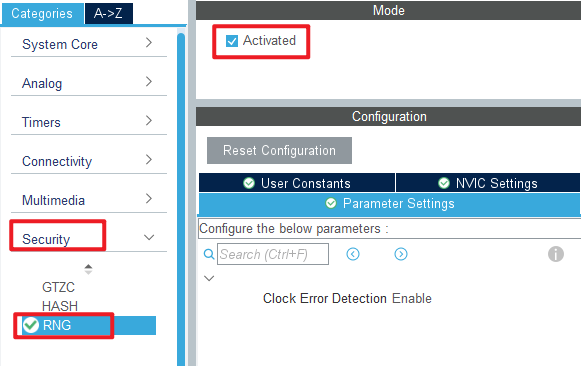
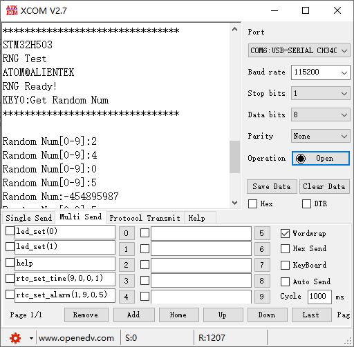
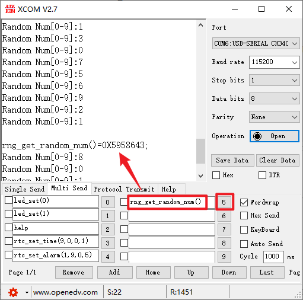

## RNG example<a name="brief"></a>


### 1 Brief
The function of this code is that the program automatically gets the random number between 0 and 9 and displays it on the serial port host computer. After pressing the KEY0 key, a 32-bit random number is obtained and displayed on the host computer of the serial port.
### 2 Hardware Hookup
The hardware resources used in this experiment are:
+ LED - PA8
+ USART1 - PA9\PA10
+ KEY - KEY0(PC13) 
+ RNG

The RNG used in this experiment is an on-chip resource of STM32H503, so there is no corresponding connection schematic.

### 3 STM32CubeIDE Configuration


We copy the **11_USMART** project and name both the project and the.ioc file **19_RNG**.Next we start the DAC configuration by double-clicking the **19_RNG.ioc** file.

Configure the RNG as shown in the following screenshot:



Click **File > Save**, and you will be asked to generate code.Click **Yes**.

##### code
###### rng.c
```c#
uint32_t rng_get_random_num(void)
{
    uint32_t randomnum;

    HAL_RNG_GenerateRandomNumber(&hrng, &randomnum);

    return randomnum;
}

/**
 * @brief   Gets a range of random numbers
 * @param   min : The minimum value
 * @param   max : The maximum value
 * @retval  gets the random number (32bit)
 */
uint32_t rng_get_random_range(int min, int max)
{
    uint32_t randomnum;

    HAL_RNG_GenerateRandomNumber(&hrng, &randomnum);

    return randomnum % (max - min + 1) + min;
}
```
This code provides two functions to get a random number, one is to get the 32-bit random number generated by the RNG directly, and the other is to process the 32-bit random number generated by the RNG to get a random number in the specified range.

###### usmart_port.c
The **usmart_nametab** array is modified in this file to facilitate the validation of RNG related functions as follows:
```c#
struct _m_usmart_nametab usmart_nametab[] =
{
#if USMART_USE_WRFUNS == 1      /* If read and write operations are enabled */
    {(void *)read_addr, "uint32_t read_addr(uint32_t addr)"},
    {(void *)write_addr, "void write_addr(uint32_t addr,uint32_t val)"},
#endif
    {(void *) rng_get_random_num, "uint32_t rng_get_random_num(void)"},
    {(void *) rng_get_random_range, "uint32_t rng_get_random_range(int min, int max)"},
};
```
The correlation function of RNG is added to USMART, so that RNG can be directly set to generate random numbers through the serial port.

###### main.c
```c#
int main(void)
{
  /* USER CODE BEGIN 1 */
  uint8_t key;
  uint32_t random;
  uint8_t t = 0;
  /* USER CODE END 1 */

  /* MCU Configuration--------------------------------------------------------*/

  /* Reset of all peripherals, Initializes the Flash interface and the Systick. */
  HAL_Init();

  /* USER CODE BEGIN Init */

  /* USER CODE END Init */

  /* Configure the system clock */
  SystemClock_Config();

  /* USER CODE BEGIN SysInit */

  /* USER CODE END SysInit */

  /* Initialize all configured peripherals */
  MX_GPIO_Init();
  MX_ICACHE_Init();
  MX_USART1_UART_Init();
  MX_TIM2_Init();
  MX_RNG_Init();
  /* USER CODE BEGIN 2 */
  stm32h503cb_show_mesg();
  /* USER CODE END 2 */

  /* Infinite loop */
  /* USER CODE BEGIN WHILE */
  while (1)
  {
    key = key_scan(0);

    if (key == KEY0_PRES)   /* Get the random number and send it to the serial port */
    {
        random = rng_get_random_num();
        printf("Random Num:%d\r\n", (int)random);
    }

    if ((t % 20) == 0)      /* Get the random number between 0 and 9 and send it to the serial port */
    {
        LED_TOGGLE();
        random = rng_get_random_range(0, 9);
        printf("Random Num[0-9]:%d\r\n", (int)random);
    }

    t++;
    HAL_Delay(10);   		 /* delay 10ms */
    /* USER CODE END WHILE */

    /* USER CODE BEGIN 3 */
  }
  /* USER CODE END 3 */
}
```


### 4 Running
#### 4.1 Compile & Download
After the compilation is complete, connect the DAP and the Mini Board, and then connect to the computer together to download the program to the Mini Board.
#### 4.2 Phenomenon
Press the reset button to restart the Mini Board, observe the LED flashing on the Mini Board, open the serial port and the host computer ATK-XCOM can see the prompt information of the experiment, indicating that the code download is successful. The host of the serial port will constantly display a random number from 0 to 9, and press the KEY0 button to generate a random number of 32 bits, as shown in the following figure:





[jump to title](#brief)