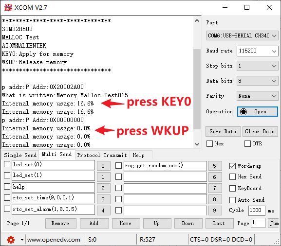

## MALLOC example<a name="brief"></a>


### 1 Brief
The function of this code is to press KEY0 to apply for memory and write content, 2K bytes of memory each time. The key WKUP is used to release the memory, only the memory applied last time can be released, and the memory management function can be tested through USMART debugging.
### 2 Hardware Hookup
The hardware resources used in this experiment are:
+ LED - PA8
+ USART1 - PA9\PA10
+ KEY - KEY0(PC13) 

This experiment uses the memory management library as a software library, so there is no corresponding connection schematic.

### 3 STM32CubeIDE Configuration


We copy the **11_USMART** project and name both the project and the.ioc file **20_MALLOC**.
The memory management library used in this experiment is a software library, which does not involve configuration on hardware and peripherals. So just add our user file ``malloc.c\malloc.h`` to the project.

##### code
###### malloc.h
```c#
/* mem1 Memory parameter setting.mem1 is completely inside the internal SRAM1 */
#define MEM1_BLOCK_SIZE         32                              /* The memory block size is 32 bytes */
#define MEM1_MAX_SIZE           12 * 1024                       /* The maximum management memory is 12K */
#define MEM1_ALLOC_TABLE_SIZE   MEM1_MAX_SIZE/MEM1_BLOCK_SIZE   /* Memory table size */

/* mem2 memory parameter setting.mem2 is in the internal SRAM2, used to manage the internal SRAM2 */
#define MEM2_BLOCK_SIZE         32                              /* The memory block size is 32 bytes */
#define MEM2_MAX_SIZE           14 * 1024                       /* The maximum management memory is 14K */
#define MEM2_ALLOC_TABLE_SIZE   MEM2_MAX_SIZE/MEM2_BLOCK_SIZE   /* Memory table size */

/* Memory Management controller */
struct _m_mallco_dev
{
    void (*init)(uint8_t);              /* initialize */
    uint16_t (*perused)(uint8_t);       /* memory usage */
    uint8_t *membase[SRAMBANK];         /* The memory pool manages the memory of the SRAMBANK regions */
    MT_TYPE *memmap[SRAMBANK];          /* Memory management status table */
    uint8_t  memrdy[SRAMBANK];          /* Memory management in place */
};
```
The program uses the macro definition **MEM1_BLOCK_SIZE** to define the total size of the internal memory pool that malloc can manage. **MEM1_ALLOC_TABLE_SIZE** represents the memory management table size of the memory pool. We can define multiple memory management tables so that we can manage multiple blocks of memory at the same time.

Through the memory management controller **_m_mallco_dev** struct, we store information about chunked memory management, its initialization function, access usage, memory pool, memory management table, and memory management status to achieve management control of the memory pool.

###### malloc.c
```c#
static uint32_t my_mem_malloc(uint8_t memx, uint32_t size)
{
    signed long offset = 0;
    uint32_t nmemb;     /* The number of memory blocks required */
    uint32_t cmemb = 0; /* The number of contiguous empty memory blocks */
    uint32_t i;

    if (!mallco_dev.memrdy[memx])
    {
        mallco_dev.init(memx);          /* Uninitialized, initialized first */
    }
    
    if (size == 0) return 0XFFFFFFFF;   /* No allocation required */

    nmemb = size / memblksize[memx];    /* Gets the number of contiguous memory blocks to allocate */

    if (size % memblksize[memx]) nmemb++;

    for (offset = memtblsize[memx] - 1; offset >= 0; offset--)  /* Search the entire memory control area */
    {
        if (!mallco_dev.memmap[memx][offset])
        {
            cmemb++;                    /* The number of contiguous empty memory blocks is increased */
        }
        else 
        {
            cmemb = 0;                  /* Contiguous memory blocks are reset */
        }
        
        if (cmemb == nmemb)             /* nmemb consecutive empty memory blocks are found */
        {
            for (i = 0; i < nmemb; i++) /* Note that the memory block is not empty */
            {
                mallco_dev.memmap[memx][offset + i] = nmemb;
            }

            return (offset * memblksize[memx]); /* Returns the offset address */
        }
    }

    return 0XFFFFFFFF;                          /* No block suitable for allocation was found */
}
static uint8_t my_mem_free(uint8_t memx, uint32_t offset)
{
    int i;

    if (!mallco_dev.memrdy[memx])                   /* Uninitialized, initialized first */
    {
        mallco_dev.init(memx);
        return 1;                                   /* uninitialized */
    }

    if (offset < memsize[memx])                     /* The offset is in the memory pool. */
    {
        int index = offset / memblksize[memx];      /* The memory block number in which the offset is located */
        int nmemb = mallco_dev.memmap[memx][index]; /* Number of memory blocks */

        for (i = 0; i < nmemb; i++)                 /* Memory blocks are reset */
        {
            mallco_dev.memmap[memx][index + i] = 0;
        }

        return 0;
    }
    else
    {
        return 2;                                   /* The offset is out of range. */
    }
}
```
The above code is used for memory allocation and memory dealing.These two functions are internal calls only, and the external calls include **mymalloc** and **myfree**.

###### usmart_port.c
To facilitate the verification of malloc-related functions, the **usmart_nametab** array is modified as follows.
```c#
struct _m_usmart_nametab usmart_nametab[] =
{
#if USMART_USE_WRFUNS == 1      /* If read and write operations are enabled */
    {(void *)read_addr, "uint32_t read_addr(uint32_t addr)"},
    {(void *)write_addr, "void write_addr(uint32_t addr,uint32_t val)"},
#endif
    {(void *)mymalloc, "void *mymalloc(uint8_t memx, uint32_t size)"},
    {(void *)myfree, "void myfree(uint8_t memx, void *ptr)"},
};
```
Functions related to MALLOC are added to USMART so that memory can be requested or freed directly via the serial port.

###### main.c
```c#
int main(void)
{
  /* USER CODE BEGIN 1 */
  uint8_t paddr[20];
  uint16_t memused = 0;
  uint8_t key;
  uint8_t i = 0;
  uint8_t *p = 0;
  uint8_t *tp = 0;
  /* USER CODE END 1 */

  /* MCU Configuration--------------------------------------------------------*/

  /* Reset of all peripherals, Initializes the Flash interface and the Systick. */
  HAL_Init();

  /* USER CODE BEGIN Init */

  /* USER CODE END Init */

  /* Configure the system clock */
  SystemClock_Config();

  /* USER CODE BEGIN SysInit */

  /* USER CODE END SysInit */

  /* Initialize all configured peripherals */
  MX_GPIO_Init();
  MX_ICACHE_Init();
  MX_USART1_UART_Init();
  MX_TIM2_Init();
  /* USER CODE BEGIN 2 */
  stm32h503cb_show_mesg();
  /* USER CODE END 2 */

  /* Infinite loop */
  /* USER CODE BEGIN WHILE */
  while (1)
  {
     key = key_scan(0);                                      /* Double-clicking is not supported */

     switch (key)
     {
         case KEY0_PRES:                                     /* KEY0 is pressed */
             p = mymalloc(SRAMIN1, 2048);                    /* Ask for 2K bytes and write something */

             if (p != NULL)
             {
                 sprintf((char *)p, "Memory Malloc Test%03d", i); /* Write something to p */
             }

             break;

         case WKUP_PRES:                                     /* WK_UP is pressed */
             myfree(SRAMIN1, p);                             /* free the memory */
             p = 0;                                          /* Point to an empty address */
             break;
     }

     if (tp != p )
     {
         tp = p;
         sprintf((char *)paddr, "P Addr:0X%08X", (unsigned int)(uint32_t)tp);
         printf("p addr:%s\r\n", paddr);                    /* Display the address of p */

         if (p)
         {
             printf("What is written:%s\r\n",p);            /* Display the contents of P */
         }
     }

     HAL_Delay(10);                                         /* delay 10ms */
     i++;

     if ((i % 20) == 0)
     {
         memused = my_mem_perused(SRAMIN1);
         sprintf((char *)paddr, "%d.%01d%%", memused / 10, memused % 10);
         printf("Internal memory usage:%s\r\n", paddr);

         LED_TOGGLE();                                      /* LED blinks */
     }
    /* USER CODE END WHILE */

    /* USER CODE BEGIN 3 */
  }
  /* USER CODE END 3 */
}
```


### 4 Running
#### 4.1 Compile & Download
After the compilation is complete, connect the DAP and the Mini Board, and then connect to the computer together to download the program to the Mini Board.
#### 4.2 Phenomenon
Press the reset button to restart the Mini Board, observe the LED flashing on the Mini Board, open the serial port and the host computer ATK-XCOM can see the prompt information of the experiment, indicating that the code download is successful. We can press the **KEY0** button to apply for memory once, and then press the **WKUP** button to release the memory, as shown in the following figure:



[jump to title](#brief)
