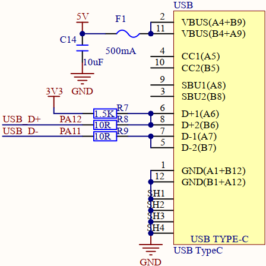
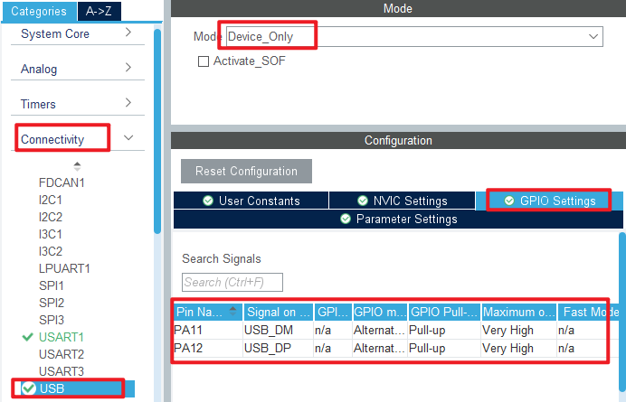
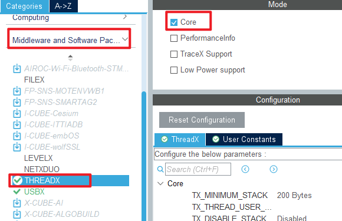
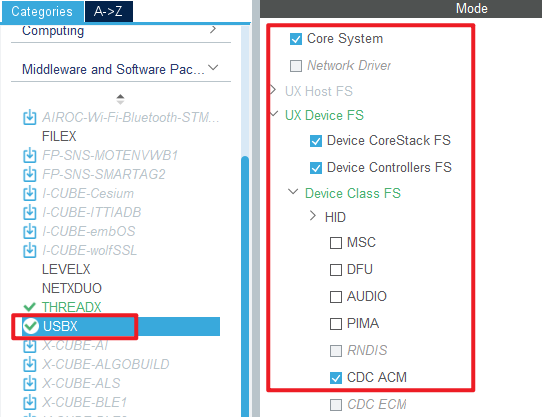
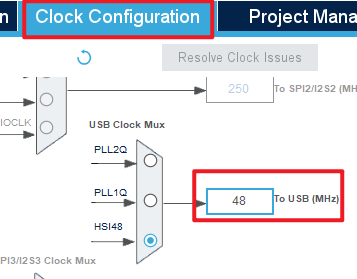
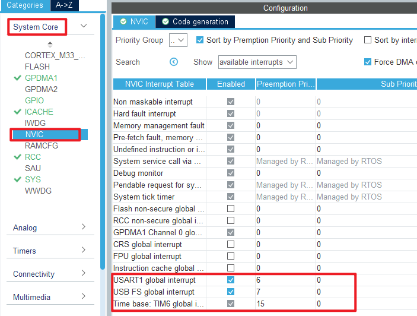
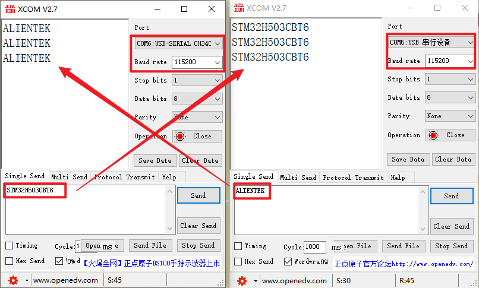

# USB_VSP example<a name="brief"></a>


### 1 Brief
The function of this code is to communicate with the PC through the virtual serial port.
### 2 Hardware Hookup
The hardware resources used in this experiment are:
+ LED - PA8
+ USART1 - PA9\PA10
+ USB_OTG

The schematic diagram of the connection between the USB interface used in this experiment and STM32H503 is shown as follows.



### 3 STM32CubeIDE Configuration


We copy the **04_UART** project and name both the project and the.ioc file **22_USB_VSP**.Next we start the DAC configuration by double-clicking the **22_USB_VSP.ioc** file.

Configure the USB as shown in the following figure:



Then click **Middleware and Software Packs->THREADX**, as shown below.



Then **Middleware and Software Packs->USBX**.



In **Clock Configuration**, the USB clock is set to 48M.



In this experiment, the USB interrupt callback function is needed to obtain the USB connection status, and the NVIC configuration is as follows.



Click **File > Save**, and you will be asked to generate code.Click **Yes**.
We need to modify the USBX related file to match our hardware information, you can open the source to see.

##### code
###### main.c
```c#
int main(void)
{
  /* USER CODE BEGIN 1 */

  /* USER CODE END 1 */

  /* MCU Configuration--------------------------------------------------------*/

  /* Reset of all peripherals, Initializes the Flash interface and the Systick. */
  HAL_Init();

  /* USER CODE BEGIN Init */

  /* USER CODE END Init */

  /* Configure the system clock */
  SystemClock_Config();

  /* USER CODE BEGIN SysInit */

  /* USER CODE END SysInit */

  /* Initialize all configured peripherals */
  MX_GPIO_Init();
  MX_GPDMA1_Init();
  MX_ICACHE_Init();
  MX_USART1_UART_Init();
  /* USER CODE BEGIN 2 */

  /* USER CODE END 2 */

  MX_ThreadX_Init();

  /* We should never get here as control is now taken by the scheduler */
  /* Infinite loop */
  /* USER CODE BEGIN WHILE */
  while (1)
  {
    /* USER CODE END WHILE */

    /* USER CODE BEGIN 3 */
  }
  /* USER CODE END 3 */
}
```


### 4 Running
#### 4.1 Compile & Download
After the compilation is complete, connect the DAP and the Mini Board, and then connect to the computer together to download the program to the Mini Board.
#### 4.2 Phenomenon
Press the reset button to restart the Mini Board, replug the USB cable, and open two serial ports of the host computer ATK-XCOM. One uses the USB virtual serial port, and the other uses the CH340 name serial port. The two can communicate with each other, as shown in the following figure:



[jump to title](#brief)
